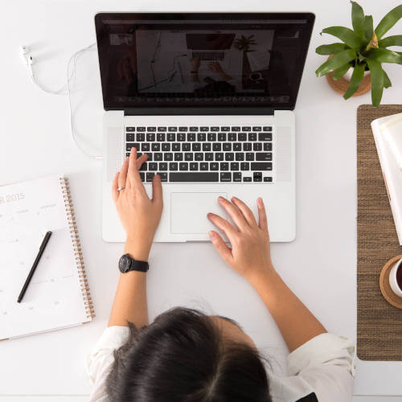

We've been busy this past month adding some pretty neat new features to Workstaff. Without further wait, here they are! Hello

Hello

<!--truncate-->

## Availability Calendar

  > Some notable things in a block quote!

  
  

  

  

  

    

    
  # Try and change the background color to `tomato`.
    
    

    

    
  # text bottom
    
    

  

  

  # Try and change the background color to `tomato`.

  

  

  > Test Title

  <iframe style={{ width: '100%', aspectRatio: '16/9' }} src="https://www.youtube.com/embed/Id64silK_7M" frameBorder="0" allow="accelerometer; autoplay; encrypted-media; gyroscope; picture-in-picture" allowFullScreen></iframe>  

  

<iframe style={{ width: '100%', aspectRatio: '16/9' }} src="https://www.youtube.com/embed/Id64silK_7M" frameBorder="0" allow="accelerometer; autoplay; encrypted-media; gyroscope; picture-in-picture" allowFullScreen></iframe> 

> Try and change the background color to `tomato`.

## Test Title