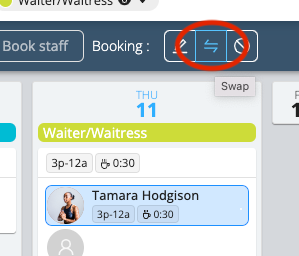
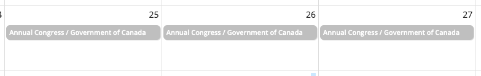
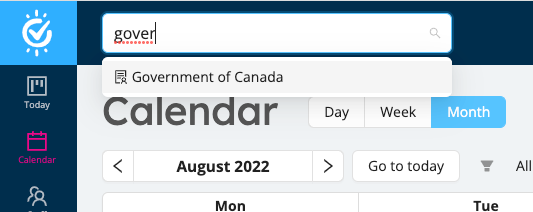
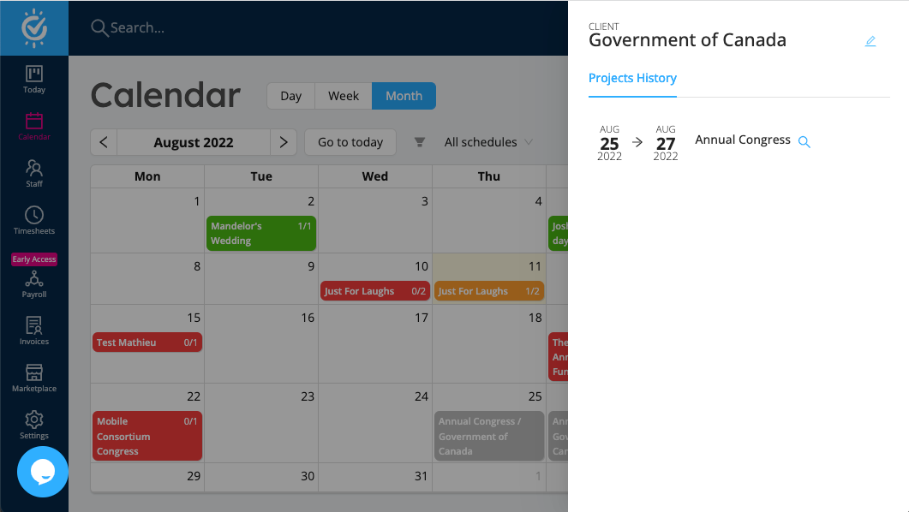
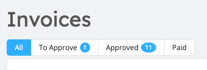
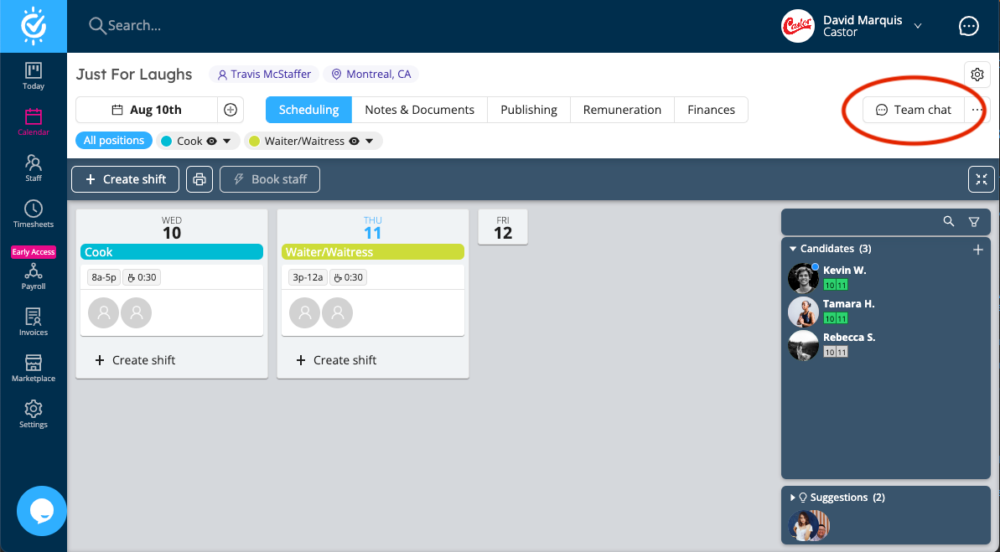

Swap staff, manage clients, invoicing improvements on the mobile app, and some other goodies are on the menu for this update.

<!--truncate-->

## Swap / Replace Staff

Previously, replacing a staff booked on a schedule was a rather complex endeavour that required many steps:

1. Cancelling the booking of the staff to replace 
2. Book the new staff, and possibly manually re-enter all work schedule details

With **Swap**, this frequently used operation is now a breeze! 

Select one or more bookings of a single staff, then click the **Swap** button:

Then Workstaff will list all people in your team that are potential candidates for the swap: 

Select a staff, confirm and it's done! The old booking is cancelled and a new booking is created for the new staff, with the
exact same schedule as the previous booking. 

We're certain this will be a great time saver to many of you! Have a try and let us know how it goes.

## Clients Management

Workstaff now lets you associate a Client to any project. This is useful if you're working scheduling staff on projects of many
clients.

A Client can be specified when creating a project:

The client name will show up in the calendar:

Client files can be searched in the global search:

And the history of projects for each client can be easily consulted:

This is a first iteration of our features made specifically for our customers who schedule their staff with different 
customers / clients. We have some other great stuff in store for the near future... stay tuned!

## Other News

### Workstaff Help Center

We recently launched the [**Help Center**](https://help.workstaff.app), which is your one-stop location to learn
everything about Workstaff. The documentation is structure in two distinct areas: **For Managers** and **For Workers**.

We'll continuously fine tune the documentation and add resources there, so come back regularly and bookmark the page for whenever you have questions 
about Workstaff.

### Invoices: more easily visualize your workload

The invoices section now displays the number of invoices in **To Approve** and **Approved** state so you can better
visualize your workload:

### Team Chat is now more easily accessible

We removed the not-very-used **Team** tab on the project screen and moved up the **Team Chat** button to be more visible 
and always present on the project screen:

### Invoicing improvements on the mobile app

The mobile app for workers has been recently updated with improvements in the invoicing section. Shifts that can be
invoiced are now visually grouped by schedule / event to make it clearer that all shifts of an event can be invoiced at 
once.

Also, Workstaff will now only allow invoices to be created for shifts with an approved time entry.

## Up Next?

We're working on some great stuff for the near future:

- **Workstaff Connect**: Give your Clients access to see who's booked on their projects, see reports and allow them to request staff directly via an easy-to-use portal.
- **Pay Run** module: Tooling to make it easier to process your payroll
