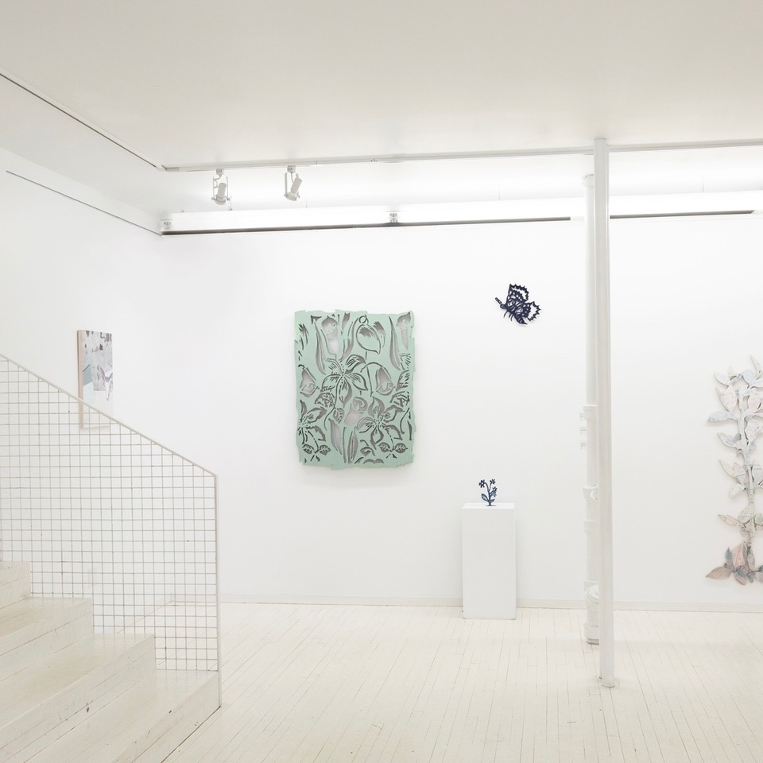

# 8 venues in Montreal for a memorable corporate event!
The long awaited moment has finally arrived: colder weather, the smell of fir throughout the house and hot chocolate under the covers. Yes, winter is upon us and it's also time for the famous Christmas parties for employees.

<!--truncate-->

Although these celebrations are all about fun and togetherness, organizing them is not always easy and can turn into a real headache!

So we thought of you, the person who has to organize THE party of the year!  We wanted to simplify your task by suggesting 8 must-see places for a successful office or family party!

## 1. Crew Collective Café
In addition to its beautiful decor, Crew Collective Café offers a unique space for your corporate events. It is the perfect place to admire historic architecture in a festive atmosphere.

**Address**: 360 rue Saint-Jacques, Montréal  
[**Learn More**](https://www.crewcollectivecafe.com/espace-a-louer-rentable-spaces?lang=en)

## 2. Le Livart 
The Livart is a non-profit organization located in a former presbytery in the Plateau-Mont-Royal. This multidisciplinary art center has several rooms that can accommodate your events of all types to allow your guests to have the time of their lives!

**Address**: 3980 rue Saint-Denis, Montréal  
[**Learn More**](https://lelivart.com/en/room/) 

## 3. Café Constance 
Located in Montreal's Quartier des Spectacles, Café Constance is in the heart of the action. The café welcomes you for your events, your 5-7 or any other occasion, all in a decor reminiscent of the Grands Ballets Canadiens.

**Address**: 1436 Balmoral Street, Montreal  
[**Learn More**](https://www.instagram.com/cafeconstance/?utm_medium=copy_link)

## 4. The McCord Stewart Museum
The McCord Museum also offers the possibility of booking a space for your private events. Located in downtown Montreal, the venue can accommodate up to 300 guests. The architecture definitely adds a touch of glamour to your party!

**Address**: 90 Sherbrooke Street West, Montreal  
[**Learn More**](https://www.musee-mccord-stewart.ca/en/room-rentals/)

## 5. Cirque Éloize
Located in the old Dalhousie Station, Cirque Éloize takes place in a historic building in Old Montreal. Their creation studios are perfect for all types of events and they are ready to welcome you in style!

**Address**: 417 Berri Street, Montreal  
[**Learn More**](https://www.eloize-events.com/en/nosstudios/)

## 6. Montreal Museum of Fine Arts
Of course, who doesn't know the Montreal Museum of Fine Arts? But did you know that they also offer the possibility to rent a private space in this majestic setting? And what's more, all guests have the chance to admire the works of the collection!

**Address**: 1380 Sherbrooke Street, Montreal  
[**Learn More**](https://www.mbam.qc.ca/en/the-museum/space-rentals/)

## 7. Le Windsor
Le Windsor offers you magnificent rooms whose décor is influenced by the Victorian and French Renaissance styles. What better place for an elegant and refined party than a ballroom?

**Address**: 1170 Peel Street, Montreal  
[**Learn More**](https://lewindsormontreal.com/en)

## 8. Montreal Science Centre
The rooms of the Montreal Science Centre, with their large windows and terraces, offer a breathtaking panoramic view of the city and the river. This is definitely the place for your next party!

**Address**: 2 de la Commune Street West, Montreal  
[**Learn More**](https://www.oldportofmontreal.com/event-venues)

## A Few Caterers
Some of these venues also allow you to hire the caterer of your choice. Here are a few that we suggest in the Montreal area!
- [**Olive Orange**](https://www.oliveorange.ca/en)                                                                                                                 
- [**Robert Alexis**](https://robert-alexis.com/en/)
- [**Bernard et fils**](https://www.bernard-et-fils-traiteur.com/en/)
- [**Julien Leblanc**](https://julien-leblanc.com/en/)
- [**Société Traiteur**](https://www.societetraiteur.com/)
- [**Traiteur Brera**](https://www.brera.ca/)
