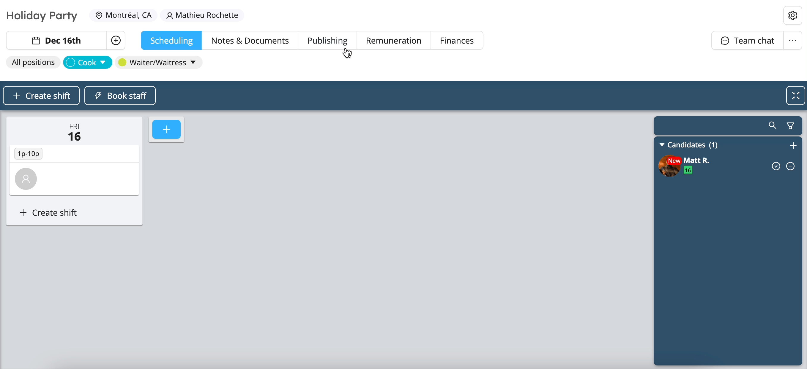
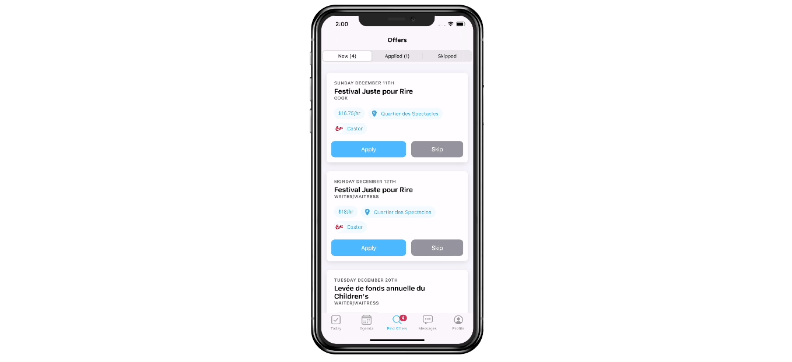

# Save Time With our Offer Publishing Feature

At Workstaff, we understand that scheduling staff can be a challenge. Finding available candidates for shifts can be laborious. Using different communication channels to contact workers to find out their availability can be a real waste of time and it can be so easily confusing.

<!--truncate-->

No more race against time! With its module for publishing job offers to staff, Workstaff allows managers to considerably reduce their scheduling time thanks to a clear process and by gathering communications within the same platform.

This feature also allows staff members to be more involved in the scheduling process and to have some control and flexibility in choosing their work hours. Workers can view and apply to offers from their cell phones in seconds.

## How Does It Work?

### For Managers

The **Publishing** feature uses matching data between your project and the skills and location of your staff members.

Once you have created your project and shifts, simply go to the posting tab to access the different publishing options. You can choose to advertise to all employees with the skill set corresponding to the shift position you wish to fill or to specific individuals.

With the staff notes, adding any additional details about your offer is easy and allows you to gather the information in one place.

### For Workers
Once the offer is published, it is immediately visible to everyone involved and they can apply in seconds with the Workstaff mobile app.

Once the applications are received, they are highlighted so that you can process them quickly and fill the vacancies in a few clicks.

## It's your turn!
Easily post job offers to your staff by going to the **Publishing** tab on your project page. Choose the position you want to post and the people for whom this offer will be visible. And that's it!

To learn more, visit our [**Help Center**](https://help.workstaff.app/docs/managers/scheduling/publish/) for more details on posting work opportunities on Workstaff. 

