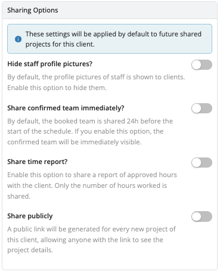

# Client Portal

The Client Portal provides your clients with an easy-to-use web dashboard where they can view their staffing projects, submit staff requests and monitor real-time progress.

Contact our [Customer Success](mailto:customer.success@workstaff.app) team to activate the **Client Portal** add-on for your Workstaff account.

## Enabling access for a client

1. Go to the **Clients** section and click on the client name for which you want to enable the portal.
2. Under **Portal**, click on **Enable access for this client**.

A unique link will be generated for this client, allowing them to join and connect with your organization.
Once the client connects for the first time, their portal status will automatically change from **Invited** to **Active**.

:::note
Click on **Send link by email** to generate an email template that you can send to your client to invite them to join.
:::

## Managing mandates

When a client submits a new mandate request, an email notification will be sent, and the request will appear in the **Mandates** section under the **Mandates to Review** list. Click **Review** to check the information provided by the client, then choose to **Accept** or **Decline** the mandate. If the mandate is accepted, a project will be automatically created for fulfillment.

## Sharing information with a client

### Sharing a project

To share a project with a client that is not linked to a mandate:
1. First, ensure the client is associated with the project. This can be done during the project creation process or later in the project settings.
2. Next, go to the project settings, navigate to **Portal**, and click on **Share with client**.

### Updating sharing options

The following sharing options are available:
- **Share staff profile pictures**
- **Share confirmed team immediately**
- **Share time report**
- **Share publicly**

You can configure these options directly at the client level, which will apply them by default to all future shared projects for that client. Alternatively, you can adjust the sharing settings for a specific project directly from the project settings to tailor them as needed.

## Managing Portal access

If you need to modify or revoke access to a portal, please [contact us](mailto:support@workstaff.app) for assistance.