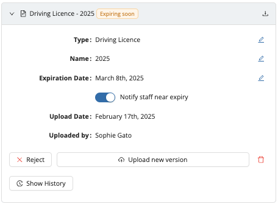

# Documents

## Streamline Your Staff Management with Documents

Workstaff's Documents feature simplifies the way you collect, organize, and manage essential paperwork for your staff. Here’s why it’s a game-changer:

- **Effortless Compliance & Organization**: Request and track required documents with ease, ensuring your team stays compliant and up-to-date.
- **Clear Notifications**: When a document is requested or nearing its expiration date, staff will receive a notification.
- **Approval Workflow**: Seamlessly review submissions—approve, reject, or request a new version—all from one centralized location.

Activate the Documents add-on today to keep your team organized and your operations running smoothly.

:::info
Take a look at our [Feature Matrix](../features-matrix.md) to see if this feature is included in your plan. Reach out to our [Customer Success](mailto:customer.success@workstaff.app) team if you have questions.
:::

## Getting Started in 3 Easy Steps

### 1. Creating A Document Type

In the **Settings** menu, click **Documents**, then create a new document type by clicking **+ Add type**. Enter a name and click **Save**.

Once created, the document type will be available for selecting when uploading documents to staff profiles.

### 2. Requesting Documents To Staff

On a staff profile, navigate to the **Documents** tab. You can **Request** a document or directly **Upload** it.

When a document is requested, staff will be prompted to upload the document. It will appear in their To-Do list under the Today tab. 
Once the document is submitted by the staff, it will appear on the staff profile as **Pending Approval**, and you'll be able to:
- **Approve** the document.
- **Reject** the document.
- **Upload a new version** of this document.
- Add an **expiration date** and choose whether to notify staff as the expiry date approaches.

:::info
Staff will receive notifications when a document is requested and when it’s nearing expiration (up to 30 days before expiration), prompting them to upload an updated version.
:::

### 3. Managing Documents

Go to the **Documents** tab to manage staff documents. Here, you’ll find an overview of:
- **To Review**: Documents uploaded by staff.
- **Expired**: Documents past their expiration date.
- **Expiring soon**: Documents set to expire within the next 30 days.
- **Waiting for document**: Documents requested from staff but not yet uploaded.