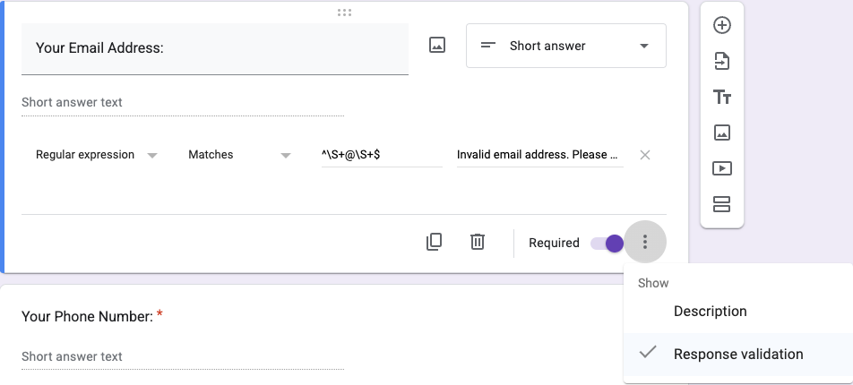
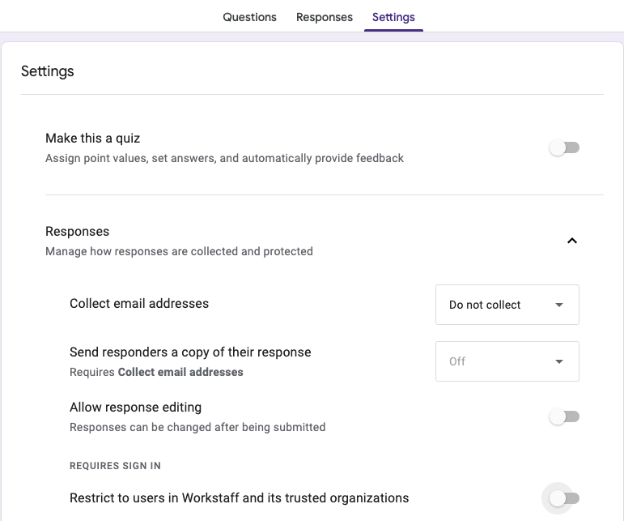
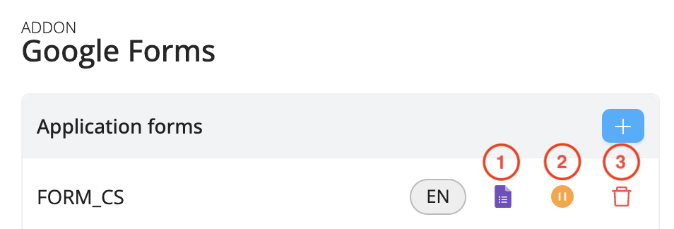

# Google Forms Integration

## Streamline Your Hiring Process with Workstaff’s Google Forms Integration

Workstaff’s Google Forms integration simplifies staff application and onboarding. Here’s why you’ll love it:
- **Save Time**: Automatically create staff profiles from Google Form responses, reducing manual data entry.
- **Customize Easily**: Tailor your forms with custom fields to gather all the information you need upfront.
- **Effortless Sharing**: Share forms via a simple link and collect responses seamlessly.

## Getting Started in 3 Easy Steps

### 1. Adding the Google Forms Add-On

- In the **Settings** section, navigate to the **Add-ons** menu and click **Activate** under **Google Forms**.
- A Google window will appear, asking for your Google account credentials to connect the two applications.

:::note
We recommend using a **generic Google account**. This will allow all users with access to this account to edit the forms.
:::

:::info
Take a look at our [Feature Matrix](../features-matrix.md) to see if this feature is included in your plan. Reach out to our [Customer Success](mailto:customer.success@workstaff.app) team if you have questions.
:::

### 2. Creating An Application Form

- On the **Add-ons** menu, click on **Configure** under **Google Forms**, and create your application form by clicking on the **+** button.
- Select the title and language.
- Select the **additional custom fields to include** in the form (responses will automatically update candidate profiles in Workstaff).

Workstaff will create a Google Form requesting candidates' first name, last name, email, and any chosen custom fields. You can edit it as needed, adding images, reordering, or adding questions.

:::note
We recommand **[creating custom fields](../staff/organizing.md#custom-fields)** beforehand to select them on the Google Form.
:::

:::note
Information provided by candidates in additional questions added directly to the Google Form (outside of Workstaff) will not be syncronized with their Workstaff profiles. However, this information can be accessed in the **Answers** tab on the Google Forms or in a linked Google Sheet by clicking on **Link to Sheets**. 
:::

**Pro Tip!** You can set up response validation to ensure candidates provide the correct type of information. For example, to make sure they enter an email address instead of a postal address, you can use a regular expression like ^\S+@\S+$ in the field.

### 3. Sharing The Form To Candidates

Before sharing the Google Form link with candidates, ensure the **Settings** are properly configured. To allow everyone to access the form, make sure the **Restrict to users in your organization and its trusted organizations** option is unchecked.

To generate a shareable link for your form, click **Send** in the top-right corner, then select **Send via Link**. You can shorten the URL if needed, then click **Copy** to share the link through your website, social media, or any preferred channel.

:::note
**Do not share the link from the URL bar of the Google Form to your candidates.** Generating a dedicated shareable link ensures the proper configuration for sharing.
:::

Once applicants submit their responses through a Google Form, Workstaff automatically creates a candidate profile, ensuring their information is ready for onboarding. See **[Managing Google Forms Candidates](../staff/staff-onboarding.md#managing-google-forms-candidates)** for the next steps.

## Managing Forms

1. **Access the Google Form**, then click on the pencil in the lower-right corner to edit it. 
2. **Pause the form**: This action prevents any further applicants from submitting their responses. You can later reactivate the Google Form by clicking the green button.
3. **Delete the form**: If needed, you can choose to remove the form entirely.

:::note
Enter an email address under **Email Notifications Preferences** to receive alerts for successful and failed submissions.
:::