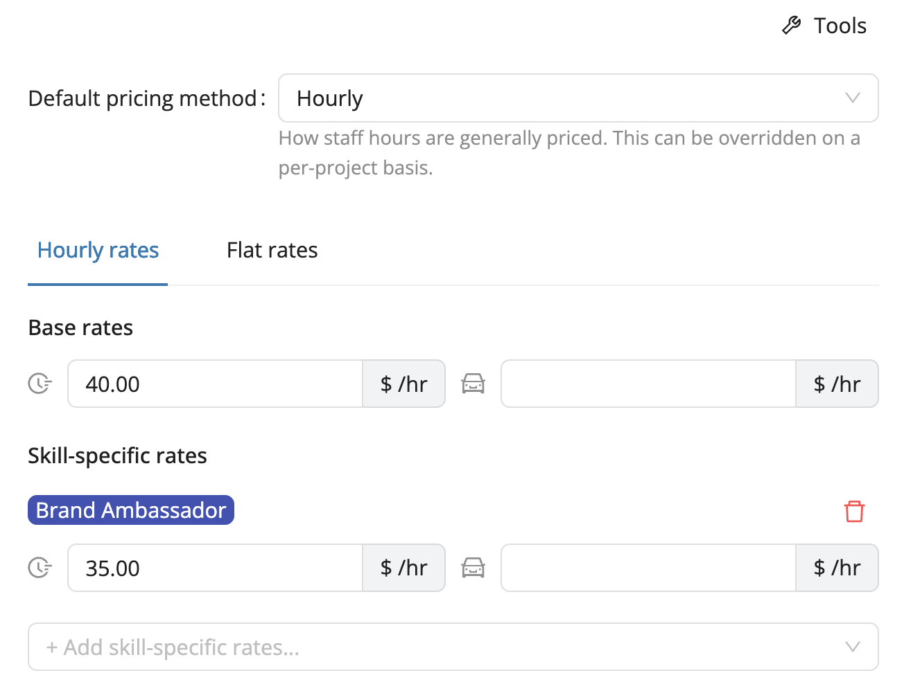

# Client Pricing

Managing how much your clients are billed for each project can be tricky, especially when you’re juggling multiple events, staff roles, and rate structures.  
The **Client Pricing** feature in Workstaff helps you keep a clear view of your client billing rates directly within your projects, so you can better **budget, track, and analyze** the financial performance of your events.

With Client Pricing, you can:
- Define billing rates for your clients and projects.
- View the **planned budget** in your project’s **Finances tab**.
- Compare billed vs. paid hours side-by-side with staff remuneration data.

## Define Bill Rates

You can define your rates globally and per skill, but still override them when needed, right down to a single project:
- **Account level** (default for your organization)
- **Client level** (specific pricing for a client)
- **Project level** (custom pricing for an event)

When configuring your billing, you can choose between different **billing modes** depending on how you charge your clients:
- **Hourly**: a flat rate per hour worked or travelled  
- **Per shift**: a fixed amount per shift  

## Track and Analyze Billable Amounts

In each project’s **Finances tab**, you can view the **budget amounts** alongside staff remuneration data. This gives you an instant view of both your **costs** (staff pay) and **revenues** (client billing) in one place.

In the **Reports** section, a new **Client Pricing** report provides a consolidated overview across your projects, clients, and specific time periods. You can easily **export this data to Excel** for deeper analysis and financial reporting.

If you have questions or feedback about how Client Pricing works or how to best configure it for your organization, our support team is always happy to help.  
Reach out via the chat or email us at **support@workstaff.app**.
