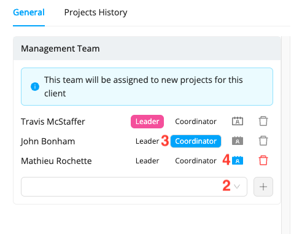

# Manage Your Client List

The **Clients** section has been designed to make it easy for you to track and manage your clients. With this section, Workstaff allows you to quickly view your list of clients and create client profiles that can be associated with your projects to maximize your calendar organization.
When a client is associated with a project, the client's name will appear on the project page and in the calendar. Additionally, you will be able to view the project history for each of your clients.

:::info
Take a look at our [Feature Matrix](../features-matrix.md) to see if this feature is included in your plan. Reach out to our [Customer Success](mailto:customer.success@workstaff.app) team if you have questions.
:::

## Adding a New Client
In the main menu, go to the **Clients** section
- Click on **Add Client**
- Fill in the company name
- Click on **Create**.

## Importing a Client List

Need to create multiple clients at once? Our bulk import tool makes it fast and easy.

Download an [example file](https://employer.workstaff.app/en/assets/import-templates/client-import.csv) to get started, then fill it out by following the import rules below:

| **Field** | **Mandatory?** | **Notes**        |
|-----------|---------------|------------------|
| Name      | Yes           | Client’s name    |
| Code      | No            | Client code      |
| Address   | No            | Client’s address |

Once your file is ready, you can import it from the **Clients** tab by clicking the **three dots** next to the **Add Client** button, then selecting **Import**.

The system will automatically detect any errors and display them **before finalizing** the import. You’ll be able to fix them and restart the import process.

Once the import reaches 100%, your clients will be created!

## General

### Basic Information
Once you have added a client to your list, you can display their profile by clicking on their name.
Under **Basic Information**, you can edit their name and add their address.

### Management Team
When you assign a management team to a client, it will automatically be assigned to all projects you create for that client.

:::info  
By default, the first person assigned to the client is assigned the roles of **Lead** and **Coordinator**. The **Coordinator** is always the main contact for the client's projects, while you can decide if the **Lead** is a contact person for the staff or not. You also have the option to choose whether the next people you add to the management team are contact persons or not. All contact persons will be included in the team conversations.
:::

**To assign a management team to a client:**

1. You can view the client's file by typing their name in the search bar or by clicking on their name on the project page
2. Under **Management Team**, click on the empty box and select the next person you wish to add to the team, then click **+**
3. Select the person's role (Lead, Coordinator, or none)
4. If they are not a **Coordinator**, set whether they are a **Contact person for staff** by selecting the icon shown in the screenshot above
5. Once the management team is composed, click **Save**.

## Archiving/Deleting a Client
You can archive a client by clicking on **Archive** next to their name in the client list.
When you archive a client, they will be removed from your active client list and moved to the "Archived" tab. This way, you can still access information and project history related to this client and choose to **unarchive** them if necessary.

You can also permanently remove a client from your list by clicking on **Delete**.

:::note
You can only delete a client if they are not attached to any project.
:::