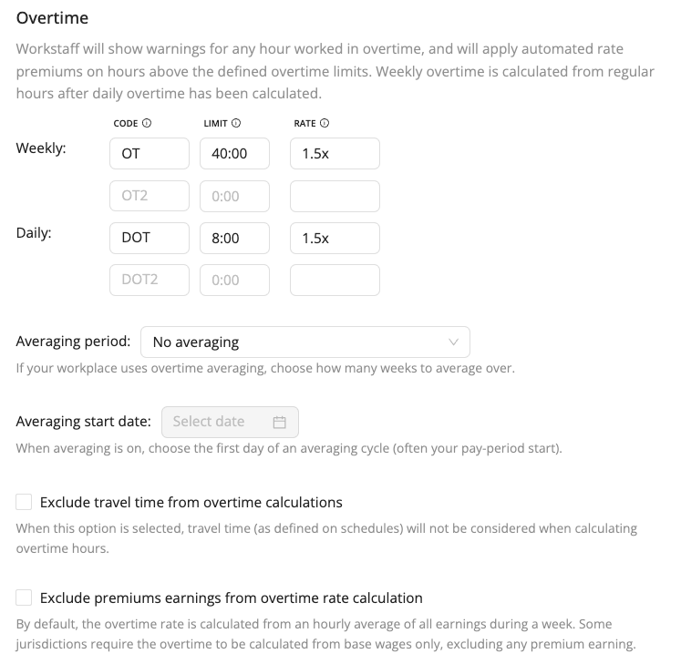

# Configure Overtime

Workstaff can calculate [and compensate](../payroll/overtime.md) overtime automatically, both daily and weekly. When overtime rules are configured in your account, Workstaff will display warnings at relevant locations, such as the weekly calendar view or when booking staff. These warnings are designed to highlight situations where unwanted overtime would be introduced by booking a certain staff.

## Setting Overtime Rules & Options

To customize the way Workstaff calculates overtime for hours worked by your team, go to **Settings** and to the **Compensation** tab.

The limits you configure here will determine when an employee starts working overtime, and how much they need to be paid in extra for hours worked in overtime. You can configure up to 2 daily rules and 2 weekly rules.

### Averaging Period

If your workplace uses **Overtime Averaging**, you can specify the number of weeks over which the average should be calculated - **2 or 4 weeks** - and set the start date of the averaging period.
When averaging is enabled, select the **first day of the averaging cycle** (typically the start of your pay period, whether past or future) so that Workstaff can properly align the averaging periods.
With this setting, weekly overtime will be calculated based on the average number of hours worked per week over the selected period.
For example, over a two-week cycle, if the average weekly total of hours worked does not exceed the overtime threshold, no overtime hours will be generated.

### Travel Time Consideration

By default, calculation of overtime hours includes travel time, which means that an 8h shift with 1h of travel time will account for a total of 9h hours for the purpose of calculating overtime. You may optionally disable this behavior if needed by checking the **Exclude travel time from overtime calculation** setting.

