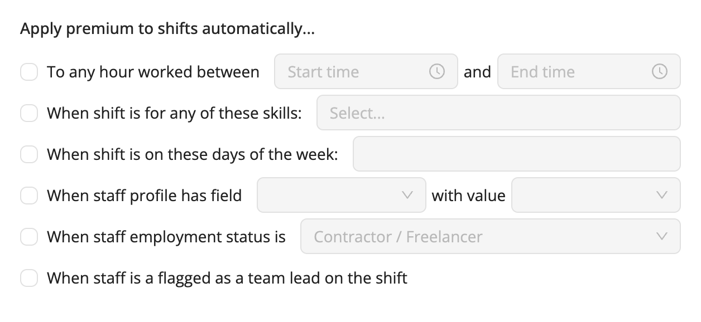

# Create Your Own Premiums 

Workstaff allows you to create your own premiums that you can later add to the remuneration conditions in your projects if required.

<iframe width="640" height="307" src="https://www.loom.com/embed/810321ab75c74f629e88648cd95e78d1" frameborder="0" webkitallowfullscreen mozallowfullscreen allowfullscreen></iframe>

## Creating Premiums
Creating your own premiums is a quick and easy task. Once created, your premiums will be available when you change the remuneration conditions in your projects.
1. Go to the **Settings** section in the main menu
2. Go to the **Premiums** section
3. Click on **Add**
4. Fill in the fields and choose whether the rate is monetary or a percentage of the base wage

## Automated Premiums 

When creating a new premium, you can choose for it to be automatically applied to shifts when one or more of the following conditions are met:

- **To any hour worked between “start time” and “end time”**: The premium will applied to all the hours worked between the start and end time you selected;
- **When shift is for any of these skills**: Every time a worker is booked for one of the selected roles, the premium is applied to their booking’s remuneration conditions;
- **When shift is on these days of the week**: The premium is applied to the shifts taking place on the selected days;
- **When staff profile has field “…” with value “…”**: The premium is automatically applied to all booked staff having the selected custom field and value in their profile;
- **When staff employment status “…”**: The premium is automatically applied to all booked staff having the selected employment status in their profile.
- **When staff is flagged as a team lead on the shift**: The premium is automatically applied to all designated team leads on the project. 

:::note
If you select multiple conditions for the same premium, please be aware that all of these conditions must be fulfilled for the premium to be applicable to shifts.
:::

