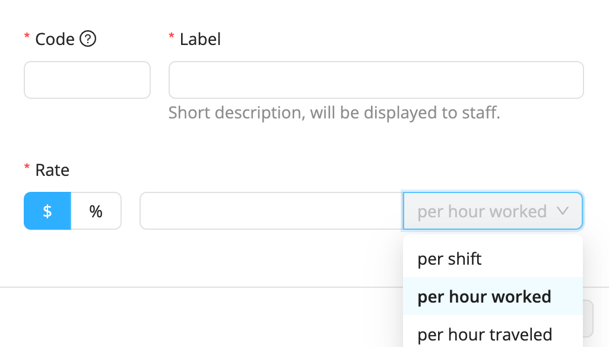

# Create Your Own Premiums 

Workstaff allows you to create your own premiums that you can later add to the remuneration conditions in your projects if required.

## Creating Premiums
Creating your own premiums is a quick and easy task. Once created, your premiums will be available when you change the remuneration conditions in your projects.
1. Go to the **Settings** section in the main menu
2. Go to the **Premiums** section
3. Click on **Add**
4. Fill in the fields and choose whether the rate is monetary or a percentage of the base wage
