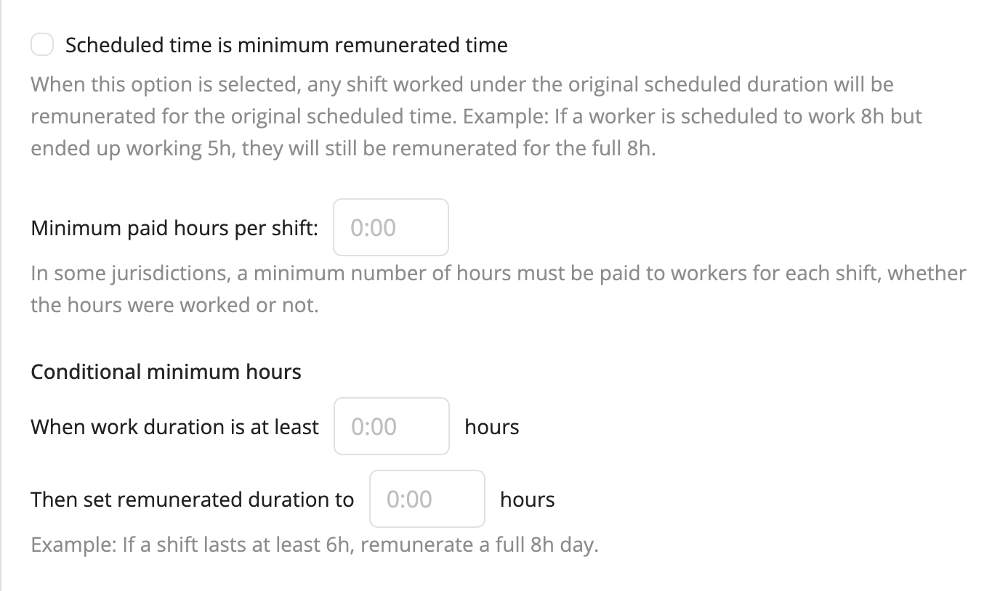
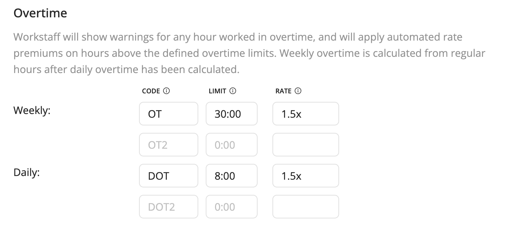

# Remuneration & Overtime Settings 

Workstaff allows you to customize the way your remuneration is calculated for your account. To do so, head to the **Account** tab of the **Settings** section, and scroll down to **Remuneration**.

Once you input values in the chosen options, they will automatically be applied to shifts when the specified conditions are fulfilled.

## Overtime Calculation
Workstaff's overtime calculation tool ensures that employees are accurately compensated for their extra hours worked. Here's how it works:

### Setting Overtime Rules
You have the flexibility to establish up to two weekly and two daily overtime calculation rules. These rules define the maximum number of hours employees can work without incurring overtime.

### Automated Rate Premiums
Workstaff automatically applies rate premiums on hours worked beyond the defined overtime limits. Weekly overtime is calculated based on regular hours after daily overtime has been accounted for.
