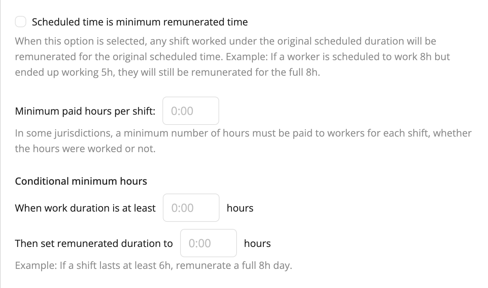

# Remuneration Settings 

Workstaff allows you to customize the way your remuneration is calculated for your account. To do so, head to the **Account** tab of the **Settings** section, and scroll down to **Remuneration**.

Once you input values in the chosen options, they will automatically be applied to shifts when the specified conditions are fulfilled.

