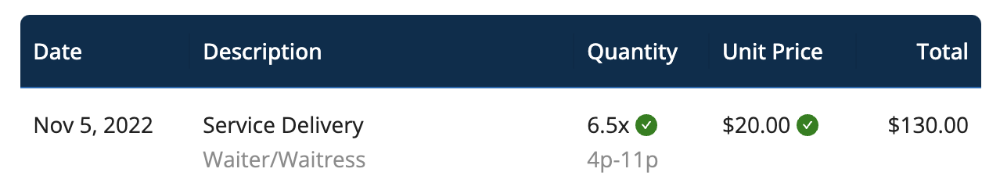
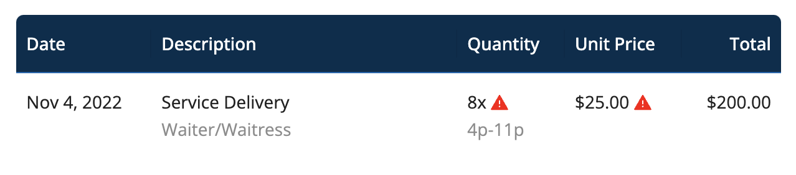

# Invoicing Workflow

## Submission

When staff submits an invoice, you can view it in the **Invoices** section of the main menu.

You can filter your invoice list in the following ways:
- All
- To Approve
- Approved
- Paid 

## Reconciliation

When the time billed matches the time entries and the hourly rate submitted matches the posted rate, Workstaff makes it easy for you to verify by displaying it on the invoice.

If the information does not match, Workstaff will show you directly on the invoice what the incorrect data is so that you can verify the information and, if necessary, chat with your staff so that they can submit a new corrected invoice.

## Verification
- If the invoiced hours match the expected hours, and the invoiced hourly rate matches the original booking, the verification icon on the invoice is **green**.

- If the invoiced hours do not match the expected hours, and the invoiced hourly rate does not match the original booking, the verification icon on the invoice is **red**. Hover your cursor over the icon to view the verification details.

## Approval

If the information on the invoice is correct, simply click on **Approve**. Your staff will be notified of the invoice approval on the mobile app and the rest of the process.

## Downloading an Invoice

You can export the invoice to a pdf format by going to **Actions** and clicking on **Download**.

## Learn More
Visit the [**Create Invoices for Your Work**](https://help.workstaff.app/docs/workers/invoices/) page in our Help Center **for workers** to learn more and share this information with your staff. 