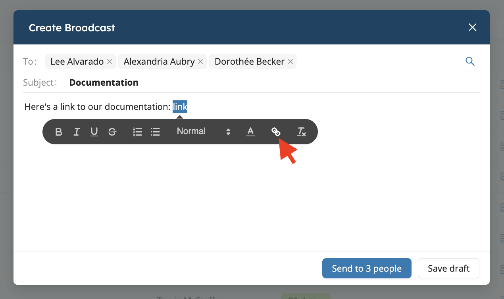
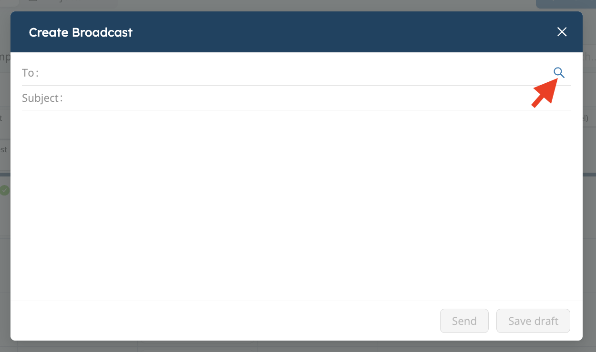
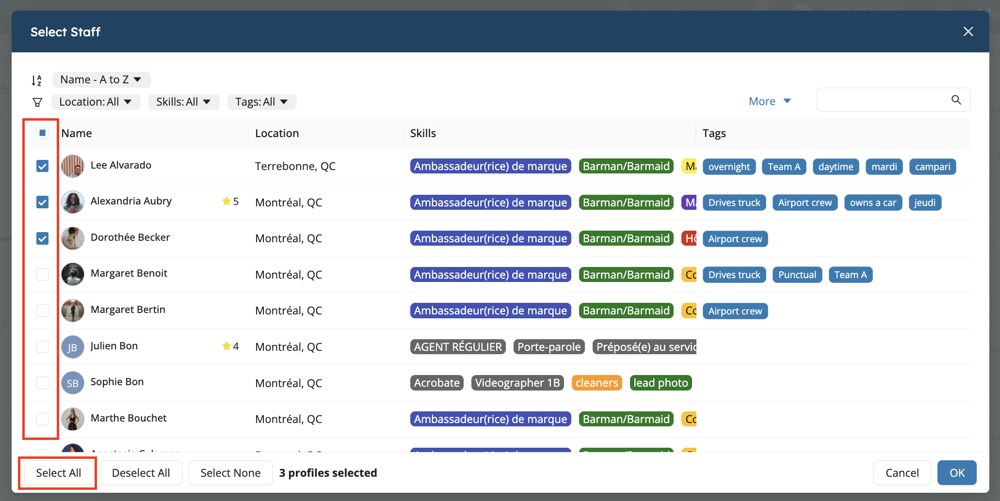

# Broadcasts: Mass Messages

Broadcasts allow to quickly and efficiently send mass messages to all your staff. They are often used in lieu of 
emails to inform teams about important information, request them to fill in their availabilities for hot periods of 
activity, or any other one-way communication needs.

Broadcasts are sent individually to each team member, and each team member who receives a broadcast message can mark 
it as read and/or reply to it if any follow up is required. 

<iframe width="640" height="308" src="https://www.loom.com/embed/c37df7aa88414780a542ce0a889fd09d" frameborder="0" webkitallowfullscreen mozallowfullscreen allowfullscreen></iframe>

## Send a Broadcast

To send a broadcast to your staff:

1. Open the **Messaging** drawer on the top right hand side of the main Workstaff user interface.
2. Click on the **Broadcasts** tab
3. Click on `+`
4. Select recipients in the `To:` field. You can also add many (or all) staff using the magnifying glass / search icon.
5. Provide a subject and compose the broadcast body, then click *Send*

### Insert a Link in a Broadcast

To insert a link in a broadcast:

1. Type the text you want to turn into a link.
2. Highlight the text.
3. Click the link icon.
4. Enter the URL.

The text will then link to the address you entered.

### Send a Broadcast to Multiple Recipients

If you want to send a broadcast to multiple people or to all staff, click the magnifying glass icon, then select staff one by one or click **Select all**.

:::info
When you send a broadcast, your staff will receive a push notification to their phone and an email. 
The push notification does not include the actual broadcast's content, but the email notification does. 
:::

## Receiving Replies to Broadcasts

Individual staff replies to broadcasts will actually be received in new [1:1 conversations](./chat.md) between the original sender of the broadcast and the staff who replied.

## Delete a Broadcast

When a broadcast becomes outdated or irrelevant, you can delete it:

1. Click the broadcast you wish to delete in the **Broadcasts** tab of the main **Messaging** drawer.
2. On the bottom left of the broadcast detail window, click **Actions** and **Delete**

Once a broadcast is deleted, it will also be removed from every recipient's messages inbox.

:::note
Although the broadcast itself disappears when deleted, any related 1:1 reply conversation will be kept.
:::