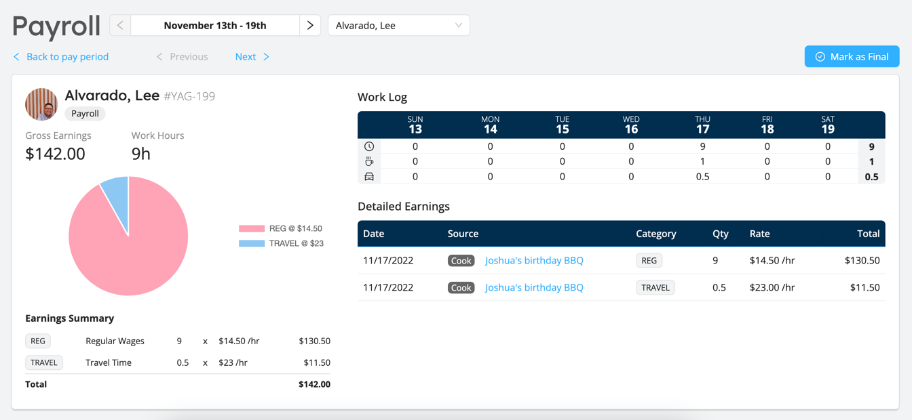

# Preparing Payroll

The Payroll module has been built to make it easier for your organization to prepare and process your pay runs.

Workstaff already has a powerful remuneration model that allows you to precisely define how you compensate your staff.
The payroll module takes it a step further: it consolidates all of you staff's earnings during each pay period and
presents you with ready-to-use numbers and reports that can be input in your external payroll software.

When you process a pay period with Payroll, the module gathers and compiles all approved time entries of workers who
were assigned to shifts during the pay period, along with the detailed remuneration information - including premiums / differentials.

Workstaff will warn you of any inconsistencies or possible missing data in your payruns and help you act upon these issues if needed. 
As you work through the warnings, you can re-generate the pay run report to reflect any changes you've made.

Once a pay period is satisfactory, the module helps you track your progress in processing pay for each of your staff by marking
stubs as _Final_. When a stub is marked as final, Workstaff freezes it so you can keep the historical data without worrying about 
possible unwanted future changes in your Workstaff data.

To get started with Payroll, [continue reading](./get-started.md)...

:::info
Take a look at our [Feature Matrix](../features-matrix.md) to see if this feature is included in your plan.
:::
