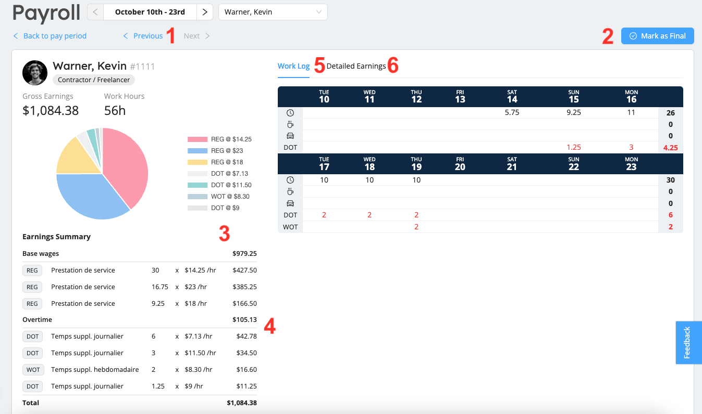
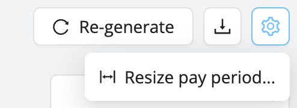

# Working Through Your Pay Runs

Once your [initial pay period](./get-started.md) is created, Workstaff will show you a summary of all employees that have had earnings during the pay period.

:::info
It is possible that upon generating a pay run, some of your staff do not show up or have incomplete data. If you think some staff members are missing or have incomplete data, make sure their employment status as well as shifts are meeting the [prerequisites](./get-started.md#prerequisites) to be considered in pay runs.
:::

## Pay Periods Are Snapshots Frozen In Time

Each pay period in Workstaff is a snapshot of your pay data taken at the moment the period was generated. Workstaff does not automatically update payroll data when adjustments are made to the underlying data such as remunerations or time entries. 

As you work through your pay run, you may need to adjust remuneration or time entries. When you do so, Workstaff will identify the changes and warn you that the payroll data is not in sync. To synchronize the payroll data, you need to manually re-generate the pay period.

:::note
Stubs marked as **Final** are not re-generated automatically. To update a stub that has been marked as finalized, you first need to re-open it, then re-generate the pay period. 
:::

## The Payroll User Interface

The Payroll module has 2 main screens: the pay period screen and the pay stub screen. 

### Pay Period Screen

The pay period screen shows a bird's eye view of all employees stubs, allows filtering and sorting through them and makes it easy to track your progress in processing the pay run.

1. **Navigator**: navigate through pay periods and pay stubs quickly.
2. **Last generated time**: Shows the moment the pay period was last generated.
3. **Actions buttons**: Re-generate the pay period, download to Excel and [resize the pay period](#resize).
4. **Filters**: Used to limit the data displayed to focus on specific tasks.
5. **Progress indicators**: As you work through the pay run and mark stubs as processed, the green checkmarks will show up beside the worker's identification to clearly visualize your progress.

### Pay Stub Screen

The pay stub screen shows, for one worker at a time, both the high level summary of earnings and the details. This screen is designed to show everything you need to populate your external payroll system.

1. **Stub Navigator**: You can directly navigate through pay stubs without the need to come back to the main pay period screen to process the pay stubs.
2. **Mark as Final button**: Mark stubs as final once you've processed them to keep track of your progress and instruct Workstaff to leave the stubs untouched even when re-generating the pay period.
3. **Earnings Summary**: This shows a sum of all earnings, grouped by earning code and rate. These are the numbers that are usually input in your payroll management software.
4. **Overtime**: Workstaff automatically [calculates and applies rate premiums](../payroll/overtime.md) on hours worked beyond the overtime limits [configured in your account](../customize/overtime.md). 
5. **Work Log**: This table shows, for every day of the period, a summary of hours worked, pauses and travel time. This can be used to quickly identify and quantify overtime. 
6. **Detailed Earnings**: This table shows every earning entry for the worker on the pay run, and allows to easily navigate to the corresponding project.

## Warnings and Alerts

Once the data has been generated for a pay period, Workstaff will warn you if there are any missing or outstanding items.

Here are the different possible warnings:

- **Some time entries have not been approved**: this warns that some time entries during the pay period were not approved, and thus were not considered in the pay period. Click on **View Timesheets** to view and approve these timesheets in the Timesheets module.
  
- **Some shifts are not included**: this warning appears when new shifts were added or approved after the pay period was last generated. As such, this data is not yet included in the pay period, and it usually needs to be re-generated. Click **Re-generate** to have the missing time entries included and the period data updated.
  
- **Remuneration data for some shifts has changed**: This warning displays if there are changes to the compensation data for at least one staff member for hours worked during the period.
  
- If any data is out of date, warnings will also appear on the far right of affected pay stubs in the pay period screen:
  
- To find out more about the problem with each stub marked with a warning, click on it to open the pay stub screen. Once there, you can click on the shift marked with a warning under **Detailed Earnings** to be redirected to the relevant project page.
  

## Search and Filter Stubs

Workstaff allows you to search and filter pay stubs to display only data relevant for different tasks.

If you want to find a specific employee's pay stubs for a specific time period, type their name or file number in the text field on the top right of the stubs table.

Use the search filters to view stubs by status (**All; Open stubs only; Final stubs only**) or related warnings (**Show obsolete stubs; Show stubs with zero earnings**).

## Mark Stubs as Final

The module helps you track exactly where you are in your payroll preparation. Mark finalized stubs by clicking on **Mark as Final**. Workstaff will then ensure that its data remains frozen, even if the underlying data, such as remuneration or time entries, was to change.

## Export to Excel

All payroll entry details - including project codes, departments, roles worked on, etc. - can be exported to an Excel file to automate your processing if necessary.

To export the period data to an Excel file, click on the download icon.

## Create the Next Pay Period

It is recommended that you wait until a pay period is over to create the pay period and process payroll data. 

You can still generate the data for the current period before it is finished if required. 

## Resize An Existing Pay Period {#resize}

If necessary, Workstaff allows you to resize your first and last pay period (which may be the same period if you have just started using the module and have a single period). 

To do so:
1. Click on the cog icon at the top right of the Pay Period page
2. Select **Resize pay period...**.  
  
3. Choose the new start and/or end date.

:::note
You can shrink or extend an existing pay period by only a limited number of days. That number depends on your pay calendar but generally speaking, Workstaff will not let you extend a period larger than twice the size of a standard pay period in the pay calendar in use for your account.
:::
