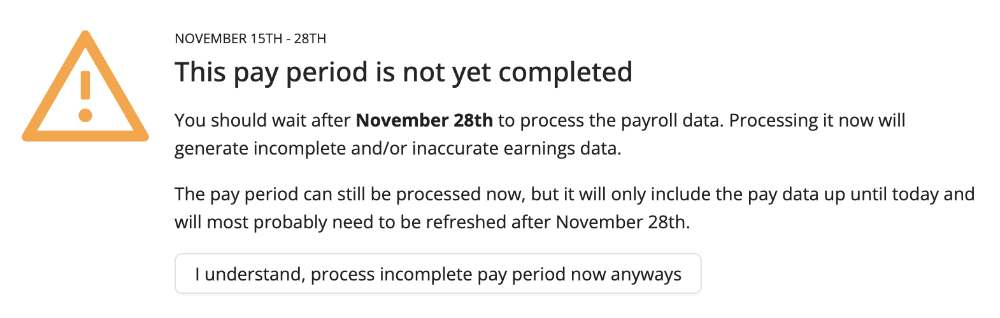
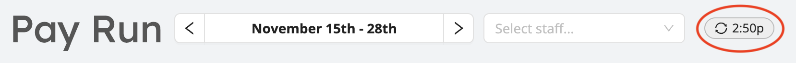
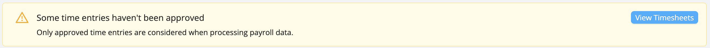
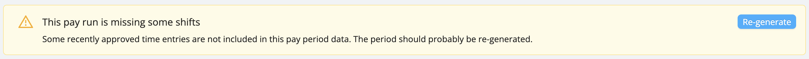
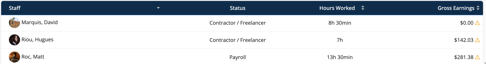
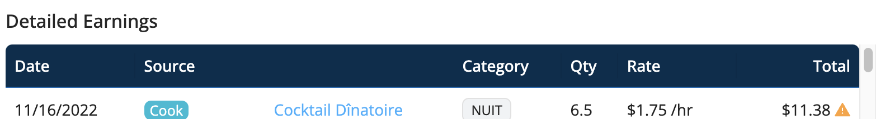
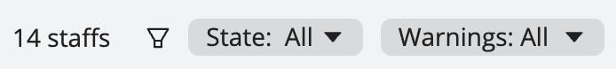
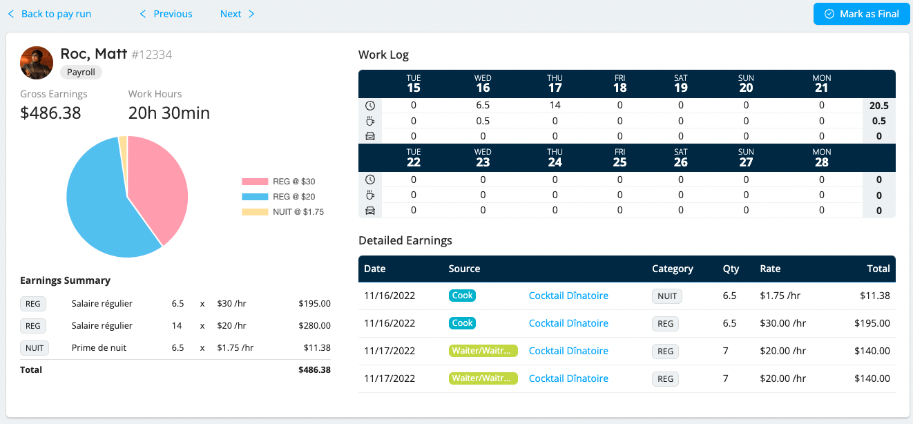
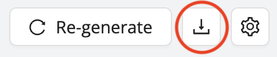
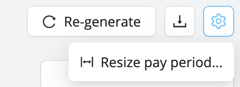

Once the timesheets for paid shifts have been submitted and approved
the associated data is generated in the Payroll Assistant module and is frozen until you re-generate the data, if necessary.

Workstaff will show you when the data for that pay period was last generated.

It is recommended that you wait until the payroll period is over to generate the data in the payroll module. You can, if you wish, generate the data for the current period before it is finished. In this case, read the warning carefully and click **I understand, process incomplete pay period now**.

Workstaff shows you when the data for this pay period was last generated.

## Proactive Problem Identification
Once the data has been generated for a pay period, Workstaff will warn you if there are any missing or outstanding items.
- **Some time entries have not been approved**: if this warning appears, click on **View Timesheets** to be redirected to the **Time Tracking** section so you can approve the missing timesheets.
  
- **Some shifts are not included**: If you have added shifts to projects in a pay period after generating the data, this data is not included in the data for that pay period. Click **Re-generate** to have the missing time entries included and the period data updated.
  
- **Compensation data for some shifts has changed**: This warning displays if there are changes to the compensation data for at least one staff member for hours worked during the period.
  
- If any data is out of date, warnings will also appear on the affected pay stubs.
  
- To find out more about the problem with each stub marked with a warning, click on it to display it. Once in the pay stub, you can click on the quarter marked with a warning under **Detailed Earnings** to be redirected to the relevant project page.
  

## Search and filter your pay stubs
Workstaff allows you to search and filter pay stubs to display specific data.

If you want to find a specific employee's pay stubs for a specific time period, type their name in **Find Person**.
Use the search filters to view stubs by status (**All; Open stubs only; Final stubs only**) or related warnings (**Show obsolete stubs; Show stubs with zero earnings**).

## Pay stubs
For each employee, see at a glance a summary of all earnings and hours worked during the pay period.
To view their pay stub, click on their name in the pay period list.

The Work Log allows you to view a summary of an employee's hours worked for each day and week of the pay period at a glance and to quantify overtime.

To easily navigate from one pay stub to another, click on **Back** and **Next**.

## Mark as Final
The module helps you track exactly where you are in your payroll preparation. Mark finalized stubs by clicking on **Mark as Final** Workstaff will ensure that the data remains frozen in time.

## Export to Excel
All payroll entry details - including project codes, departments, roles worked on, etc. - can be exported to an Excel file. - can be exported to an Excel file to automate your processing if necessary.
To export the period data to an Excel file, click on the download icon.

## Resize Pay Period
If necessary, Workstaff allows you to resize the first and last pay period. To do so:
Click on the cog icon at the top of the page
Click on **Resize pay period...**.
Select the period to be modified and choose the new dates

