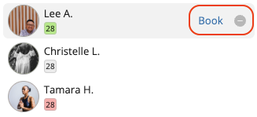
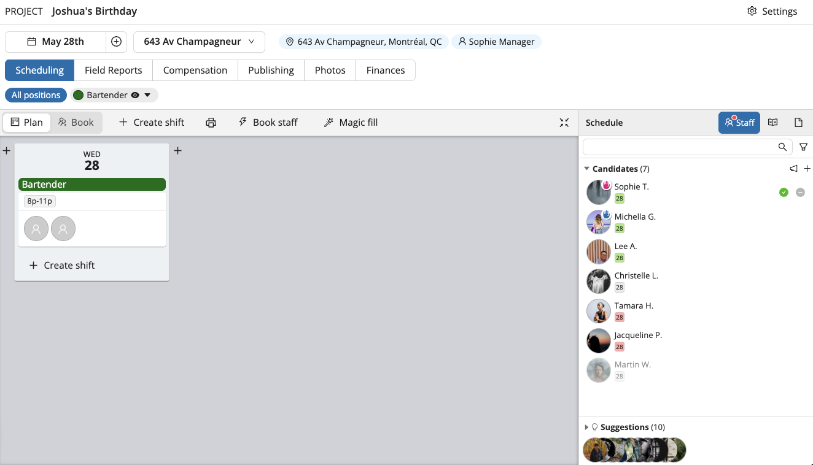
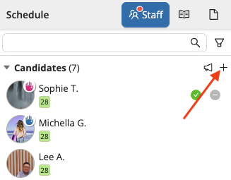
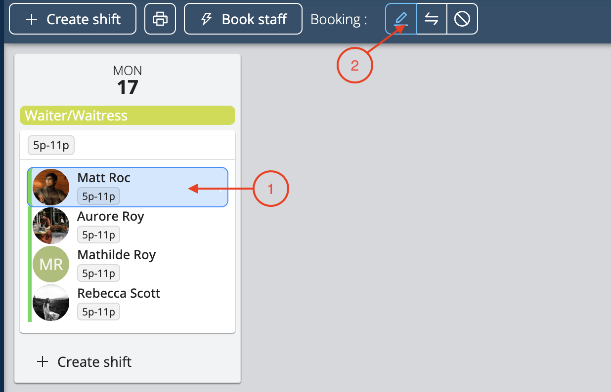

# Book Your Team

Once you have created your shifts, Workstaff allows you to book staff in the ways listed below.

<iframe width="640" height="308" src="https://www.loom.com/embed/3bfd22c4abad46309caec76b0328a2ba" frameborder="0" webkitallowfullscreen mozallowfullscreen allowfullscreen></iframe>

## Booking Staff From Your List of Suggestions
Workstaff allows you to select staff from a list of suggestions based on the skills, availability and grades of each profile.
1. On the project page, select the shift and click on **Book staff**
2. Select staff you wish to book from the list of suggestions
3. Click on **Book X staff** 

## Booking Staff Using The Candidates Organizer

The **Candidates** organizer is a tool that allows you to book staff in different ways.
In this tab, you can see at a glance the **Candidates** that have applied for positions you’ve published and staff **Suggestions**.

### Booking Candidates That Have Applied For Positions
1. Use the search bar and the filters if you are looking for specific profiles
2. In the "Candidates" organizer, place your cursor on the candidate's name
3. Click on "Book"
4. Select the position and the shift(s) you wish to book the candidate for
5. Click on **Book**.

If you are not interested in an application, you can click on **Put aside** next the candidate’s name. You can later decide to move the staff you’ve put aside back to the list of Candidates by clicking on **Keep** next to their name.  

## Staff Availability
When your staff members [**share their availability using the mobile app**](../../workers/availability.md), this information is displayed in various sections of the web platform, including:
- **Staff Suggestion List** 
- **Candidate Organizer** 
- **Day View** of the calendar

Staff availability is indicated by different colors:
- **Grey**: No availability information provided by the worker.
- **Green**: The staff has indicated they are available. 
- **Orange**: The staff is partially available, and the proposed shift overlaps with their unavailable period.
- **Red**: The staff has indicated they are unavailable.
- **Blue**: The staff is already scheduled for all or part of the shift you are planning to assign.

This colour-coded system helps you quickly understand the availability status of your staff members, making it easier to efficiently manage shifts and bookings.

### Sorting Your Candidates
After clicking the **Keep** button to mark candidates you’re considering, you can see who has applied for each position by selecting it. Look for the raised hand icon next to each candidate.

:::tip
Tips for understanding candidate display:
- **Pink raised hand**: The candidate has applied, but their application hasn’t been reviewed yet.
- **Blue raised hand**: The candidate has applied and has been marked as “kept” for consideration.
- **Name appearing in light grey**: This means the required skill for the selected position is absent from their profile.
:::

### Booking Staff That Does Not Appear in The Suggestions
If you wish to book staff that doesn't appear in your list of suggestions, you can access your entire staff list by clicking on **+** in the **Candidates** organizer.
You will then be able to search for specific staff using the search bar and the filters. Once selected, they will be added to the **Candidates** organizer.  

### Selecting Staff Without Booking Them Yet
If you wish to make a list of the staff that will work on your project without booking them on any specific shift yet, you can also click on **+** in the **Candidates** organizer to add them top your list of candidates you can later book.

## Choosing a Team Leader
Once you have booked someone for a shift, you can choose to make them a Team Leader.
1. Select the person's booking by clicking on their photo bubble or their name in the shift
2. Click on the pencil icon **Edit**

3. Check off **Team Leader** and click **Ok**.

## Expand and Collapse Bookings
When you book a large amount of people on a project, Workstaff automatically collapses the shifts' details. 
You can freely expand and collapse the details of all your shifts by clicking on the **Expand/Collapse** icon on the top right of the project page. 
You can also expand and collapse the details of each shift by placing your cursor on it and clicking on the **Expand/Collapse** icon.  

