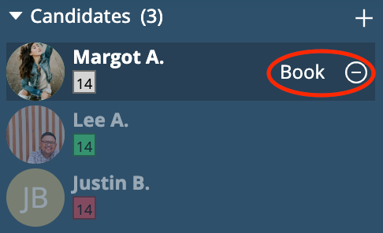
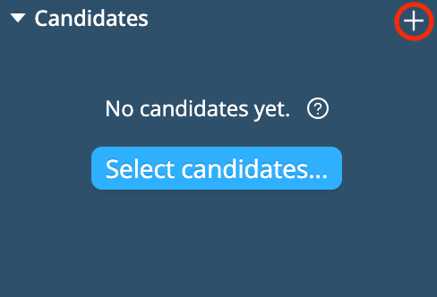
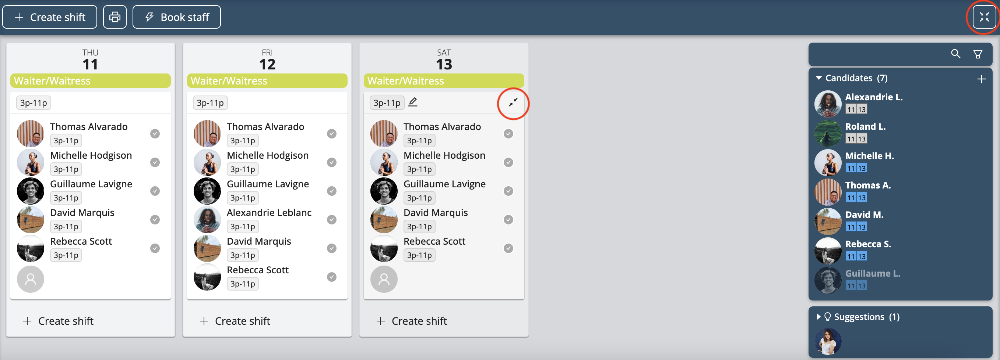

# Book Your Team

Once you have created your shifts, Workstaff allows you to book staff in the ways listed below.

<iframe width="640" height="308" src="https://www.loom.com/embed/3bfd22c4abad46309caec76b0328a2ba" frameborder="0" webkitallowfullscreen mozallowfullscreen allowfullscreen></iframe>

## Booking Staff From Your List of Suggestions
Workstaff allows you to select staff from a list of suggestions based on the skills, availability and grades of each profile.
1. On the project page, select the shift and click on **Book staff**
2. Select staff you wish to book from the list of suggestions
3. Click on **Book X staff** 

## Booking Staff Using The **Candidates** Organizer

The **Candidates** organizer is a tool that allows you to book staff in different ways.
In this tab, you can see at a glance the **Candidates** that have applied for positions you’ve published and staff **Suggestions**.

### Booking Candidates That Have Applied For Positions
1. Use the search bar and the filters if you are looking for specific profiles
2. In the "Candidates" organizer, place your cursor on the candidate's name
3. Click on "Book"
4. Select the position and the shift(s) you wish to book the candidate for
5. Click on **Book**  
   If you are not interested in an application, you can click on **Put aside** next the candidate’s name. You can later decide to move the staff you’ve put aside back to the list of Candidates by clicking on **Keep** next to their name.  
   

### Booking Staff That Does Not Appear in The Suggestions
If you wish to book staff that doesn't appear in your list of suggestions, you can access your entire staff list by clicking on **+** in the **Candidates** organizer.
You will then be able to search for specific staff using the search bar and the filters. Once selected, they will be added to the **Candidates** organizer.  

### Selecting Staff Without Booking Them Yet
If you wish to make a list of the staff that will work on your project without booking them on any specific shift yet, you can also click on **+** in the **Candidates** organizer to add them top your list of candidates you can later book.

### Expand and Collapse Bookings
When you book a large amount of people on a project, Workstaff automatically collapses the shifts' details. 
You can freely expand and collapse the details of all your shifts by clicking on the **Expand/Collapse** icon on the top right of the project page. 
You can also expand and collapse the details of each shift by placing your cursor on it and clicking on the **Expand/Collapse** icon.  

