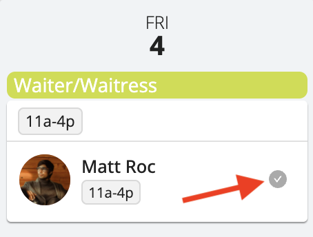
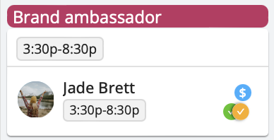
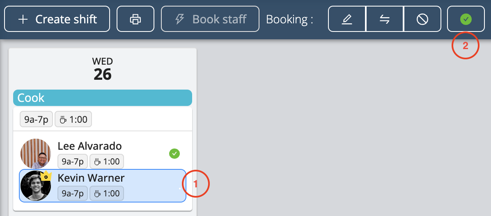

# Staff Confirmation of Schedules

When you book staff for a shift or whenever changes are made to their schedule, Workstaff sends them a notification to request a confirmation of their work schedule.

## Track the status of the confirmation request

Workstaff allows you to track the status of the confirmation request sent to a person at a glance with the confirmation icon found in the booking next to the person's name.

If this icon is:
- **Gray**: waiting for confirmation
- **Green**: the person has confirmed this shift
- **Red**: the person has requested a cancellation for this shift
- **Orange**: the person has not confirmed this shift within the required timeframe.

### Follow-up confirmation
If a booking was created and confirmed over 72 hours ago and is starting in approximately 24 hours, a second confirmation will be requested from the staff.

:::info
This feature is available when the project reminder settings are enabled for follow-up confirmations and is not applicable to projects using weekly scheduling.
There will be only one follow-up confirmation for each group of shifts booked together, based on the date of the first booking.
:::

## What if the Person Changes Their Mind?
If a person has confirmed a shift, but for some reason cannot work it and must cancel it, they should contact their supervisor as soon as possible to have the necessary changes made in the schedule. 

## What if the Person Cannot or Forgets to Confirm?
In the event that some of the people you have assigned to shifts are not able to confirm their shifts, you have the option of marking those shifts as confirmed so that all your project scheduling information is up-to-date.
In order to mark a booking as confirmed, select the booking and click on the **Mark as Confirmed** button. 

## Learn More
Visit the [**Confirm Your Schedules**](../../workers/shifts/confirming-shifts.md) page in our Help Center **for workers** to learn more and share this information with your staff. 

