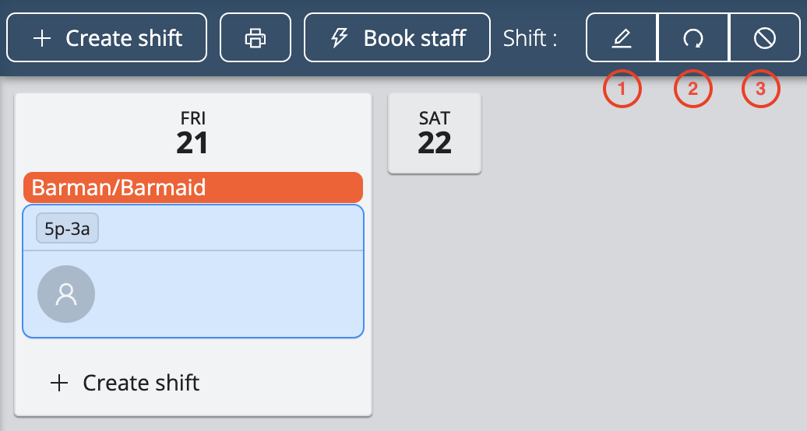

# Editing Shifts and Bookings

On the project page, there are ways for you to easily edit multiple shifts or multiple bookings at once.

<iframe width="640" height="307" src="https://www.loom.com/embed/fa218e5279844c948ebda2c71f58257d" frameborder="0" webkitallowfullscreen mozallowfullscreen allowfullscreen></iframe>

## Selecting Multiple Shifts
Selecting several shifts allows you to assign staff to the selected shifts and to cancel them at once.
- To select all shifts on the project page, double click on one shift
- To select specific shifts on the project page, press **Ctrl** (Windows) or **Command** (macOS) and select the shifts you wish to edit as shown below

## Selecting Multiple Bookings
Selecting multiple bookings allows you to cancel multiple bookings at once.
- To select all of one staff’s bookings in a project, double click on one of their bookings as shown below
- To select specific bookings, press **Ctrl** (Windows) or **Command** (macOS) and select the bookings you wish to edit

## Editing Shifts 
Workstaff allows you edit, repeat and delete your shifts, even after you have booked staff.
Select the shift you wish to edit and follow the following instructions: 
1. **Editing a Shift**: Click on the **Edit** button in order to modify the label, the planned time and the number of staff needed for the shift.
2. **Repeating a shift**: Click on the **Repeat** button, choose the date you wish to copy the shift on. Note that if you have already booked staff on that shift, they will be copied with the shift.
3. **Cancelling a shift**: Click on the **Cancel** button. 

## Editing Bookings
Select the booking you wish to edit by clicking on the name of one of the people you have booked and follow the following instructions: 
1. **Editing a Booking**: Click on the **Edit** button in order to modify the schedule for this specific booking. Provide a detailed schedule for each staff.
2. **Swapping Staff on a Booking**: Click on the **Swap** button after selection the booking, and select the person you wish to place the booked staff member with.
3. **Cancelling a Booking**: Click on the **Cancel** button and the booking will be vacant and ready to be filled with another staff member. 

