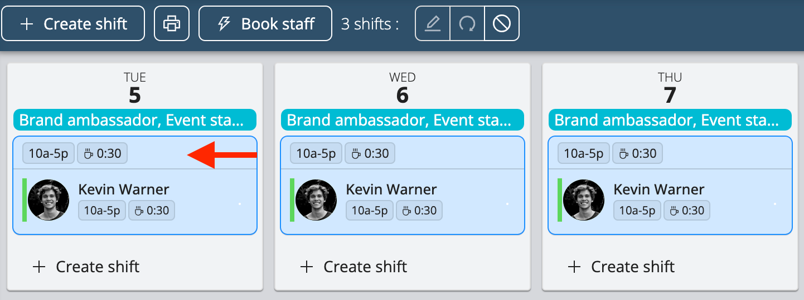
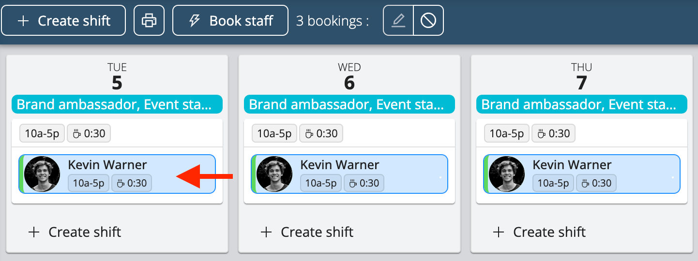

# Editing Shifts and Bookings

On the project page, there are ways for you to easily edit multiple shifts or multiple bookings at once.

<iframe width="640" height="307" src="https://www.loom.com/embed/fa218e5279844c948ebda2c71f58257d" frameborder="0" webkitallowfullscreen mozallowfullscreen allowfullscreen></iframe>

## Selecting Multiple Shifts
Selecting several shifts allows you to assign staff to the selected shifts and to cancel them at once.
- To select all shifts on the project page, double click on one shift
- To select specific shifts on the project page, press **Ctrl** (Windows) or **Command** (macOS) and select the shifts you wish to edit as shown below

## Selecting Multiple Bookings
Selecting multiple bookings allows you to cancel multiple bookings at once.
- To select all of one staff’s bookings in a project, double click on one of their bookings as shown below
- To select specific bookings, press **Ctrl** (Windows) or **Command** (macOS) and select the bookings you wish to edit

