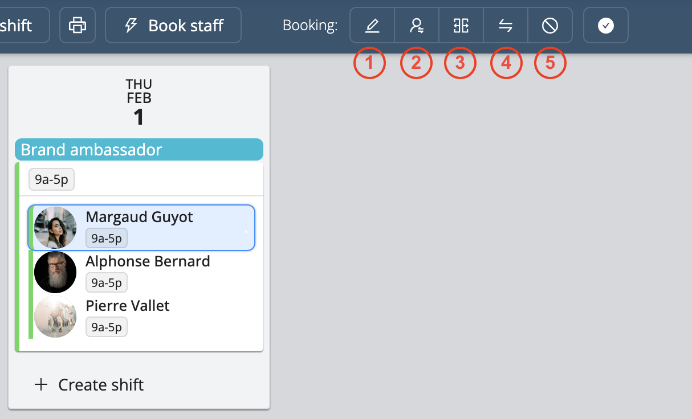

# Editing Shifts and Bookings

On the project page, there are ways for you to easily edit multiple shifts or multiple bookings at once.

<iframe width="640" height="307" src="https://www.loom.com/embed/fa218e5279844c948ebda2c71f58257d" frameborder="0" webkitallowfullscreen mozallowfullscreen allowfullscreen></iframe>

## Selecting Multiple Shifts
Selecting several shifts allows you to assign staff to the selected shifts and to cancel them at once.
- To select all shifts on the project page, double click on one shift
- To select specific shifts on the project page, press **Ctrl** (Windows) or **Command** (macOS) and select the shifts you wish to edit as shown below

## Selecting Multiple Bookings
Selecting multiple bookings allows you to cancel multiple bookings at once.
- To select all of one staff’s bookings in a project, double click on one of their bookings as shown below
- To select specific bookings, press **Ctrl** (Windows) or **Command** (macOS) and select the bookings you wish to edit

## Editing Shifts 
Workstaff allows you edit, repeat and delete your shifts, even after you have booked staff.
Select the shift you wish to edit and follow the following instructions: 
1. **Edit**: Modify the label, the planned time and/or the number of staff needed for the shift.
2. **Change Position**: Change the position of a shift and of all the people booked on it.
3. **Split**: Divide a shift to allocate the planned time among different positions for all bookings within this shift.
4. **Repeat**: Choose the date you wish to copy the shift on. Note that if you have already booked staff on that shift, they will be copied with the shift.
5. **Cancel**: Click on **Cancel** to delete the selected shift.

## Editing Bookings
Select the booking you wish to edit by clicking on the name of one of the people you have booked and follow the following instructions:
1. **Edit a Booking**: Modify the schedule for this specific booking. Provide a detailed schedule for each staff.
2. **Change Position**: Change the position of the selected worker.
3. **Split**: Divide a booking to allocate the planned time among different positions for the selected worker.
4. **Swap Staff on a Booking**: Click on the **Swap** button after selecting the booking, and select the person you wish to replace the booked staff member with.
5. **Cancel**: Click on the **Cancel** button and the booking will be vacant and ready to be filled with another staff member.

## Reverting the Last Changes 
Workstaff offers you the flexibility to revert the last changes within your projects. This feature serves as a safety net, allowing you to backtrack and correct any modifications or mistakes.

Workstaff offers you the flexibility to revert the last changes within your projects. This feature serves as a safety net, allowing you to backtrack and correct any modifications or mistakes.

1. **Revert Last Changes**: This function enables you to retract the most recent action performed in your project. Whether it’s adding, deleting, or modifying shifts and bookings, it swiftly restores the project to its previous state. You can use it to backtrack through a series of actions, progressively reverting all changes made since the last saved version of the project.
2. **Discard All Draft Changes**: This function allows you to discard all unsaved modifications and revert the project to its last saved state. If you've made multiple adjustments but wish to return to the original saved version without individually undoing each change, this feature efficiently clears all draft modifications, ensuring a clean slate for further editing or review.
