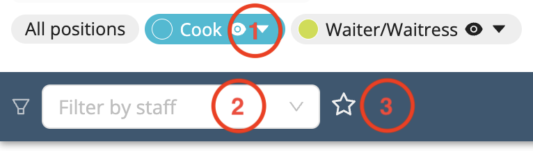

# Event Photos
Workstaff allows your staff to post event photos to their shifts.

These photos can include anything from event setups and team activities to interactions with clients or attendees. Managers can get a visual glimpse into the events and gain valuable insights from the ground level.

All event photos are neatly organized within the projects, making it easy to know who has posted them, revisit past events, track progress, and use them for future reference.

## Viewing Event Photos

In order to view the event photos posted by your staff, head to the project page, and then to the **Photos** tab.

All photos posted by your staff will be displayed in this tab.

By hovering your mouse on the photos, you can display the name of the person who has posted them and options such as:
-	Marking the photo as a favourite
-	Downloading the photo
-	Deleting the photo

In the event that you might need to delete multiple photos, you can click on **Select Many**, then on the **Delete** button.

Workstaff also allows you to filter the photos submitted by your staff:
1. Filter by role
2. Filter by staff
3. Only display favourite photos

To display photos that have just been submitted by your staff, you can click on the **Refresh** button.

