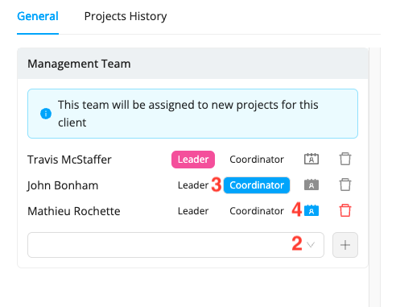

# Assign Management Teams to your Clients and Projects

Workstaff allows you to assign specific management teams to each of your clients and projects. You can add as many people as you want to these teams and choose which ones are included in the team discussions related to these projects. Each member of the management team can then see exactly which projects are assigned to them in the **Calendar**, by choosing to display their **schedules only**.

## Assigning a Management Team to a Client

When you assign a management team to a client, it will automatically be assigned to all projects you create for that client.

:::info  
By default, the first person assigned to the client is assigned the roles of **Lead** and **Coordinator**. The **Coordinator** is always the main contact for the client's projects, while you can decide if the **Lead** is a contact person for the staff or not. You also have the option to choose whether the next people you add to the management team are contact persons or not. All contact persons will be included in the team conversations.
:::

### To assign a management team to a client:

1. You can view the client's file by typing their name in the search bar or by clicking on their name on the project page
2. Under **Management Team**, click on the empty box and select the next person you wish to add to the team, then click **+**
3. Select the person's role (Lead, Coordinator, or none)
4. If they are not a **Coordinator**, set whether they are a **Contact person for staff** by selecting the icon shown in the screenshot above
5. Once the management team is composed, click **Save**.

## Assigning a Management Team to a Project
Workstaff also allows you to assign a management team to each of your projects, whether they are associated with a client or not.

:::note  
If you want to assign a management team to a client’s project that already has a team associated with them, the team assigned specifically to the project will be in charge of it.
:::

### To assign a management team to a project:
1. Go to your project page
2. Click on the cog icon, then on **Settings**.
3. Under **Management Team**, click on the empty box and select the next person you wish to add to the team, then click **+**
4. Select the person's role (Lead, Coordinator, or none)
5. If they are not a **Coordinator**, set whether they are a **Contact person for staff**
6. Once the management team is composed, click **Save**