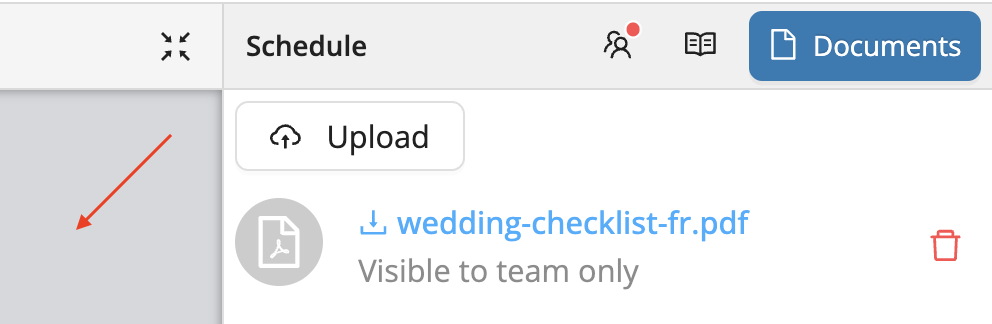

# Notes and Documents

Workstaff gives you the flexibility to share important information with your staff by uploading documents and adding notes at different levels of the project.

## Uploading Documents

You can upload PDF, PNG, or JPG files to your project to make them available to your staff.

**To upload documents**, click on the grey area indicated by the arrow below. In the drawer that appears (the inspector), click on the **document icon**, then click **Upload** to attach your files.

Once uploaded, staff assigned to the project will be able to view these documents in the mobile app under the **Important Readings** section of their shift details.

## Adding Notes

Notes can be used to share context, instructions, or updates with your team. You can add them at different levels depending on the audience and purpose:

- **Global notes** (under the “Shared with staff” tab): visible to all booked staff, as well as those included in the audience if an offer was published.
- **Skill-based notes** (under the “Shared with staff” tab): visible only to staff with the **specific skill**.
- **Shift-specific notes**: visible only to staff booked on that **particular shift**.
- **Private notes**: visible **only to managers**. These can be added at the **shift level** or at the **schedule level**.

:::note
Notes are identified by the **open book icon** 📖 throughout the platform, making them easy to spot at a glance.
:::