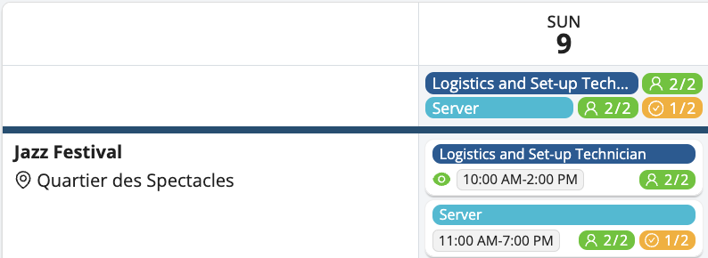
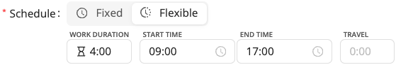

# Plan a Project

<iframe width="640" height="306" src="https://www.loom.com/embed/987c200a36864fe9988d3527780713be" frameborder="0" webkitallowfullscreen mozallowfullscreen allowfullscreen></iframe>

## Projects View

In the Calendar section, switch to the **Week** view and click **Projects View**. This view offers a high-level summary of project progress, organized by project and skill.

Key highlights of this view:
- **Published shifts**: Marked with a green eye icon.
- **Applicants to review**: Marked with a pink raised hand.
- **Unassigned shifts or skills**: Indicated by a person icon.
- **Pending confirmations**: Shown with a check icon.

## Creating a New Project

Creating a project in Workstaff is a quick and easy task:
1. In the main menu, go to the **Calendar** section.
2. Click on **New Project**.
3. Fill in the information shown below to create the basis for detailing the project later.

### Adding Shifts 
Once you have created your project, you can add shifts: 
1. On the project page, click on **Create Shift**.
2. Select the date(s).
3. Choose the position for the shift from your list of skills.
4. Choose the **schedule type**: either **Fixed**, then select the start and end times, or [**Flexible**](#flexible-schedules).
5. Fill-in the number of staff needed.
6. If you wish, you can add a label and select break and travel times.

#### Flexible Schedules

If you select the **Flexible** option when adding a shift, you'll be able to:
- Set the **number of hours** the staff should work (e.g. 4 hours).
- Define a **time range** within which those hours must be completed (e.g. between 9:00 AM and 5:00 PM).

This means staff can **clock in anytime within that range**, complete their required hours, then clock out. It gives more autonomy to the staff while maintaining control over worked hours.

### Draft Mode 

When creating a new project, Workstaff makes you work in draft mode by default. This allows you to make any changes you want and apply them to the project once you are satisfied by clicking on **Review and Apply** on the project page. Only then will your staff receive a notification regarding their bookings.

You still can make changes to your project after reviewing and applying, and these new changes will automatically put your project in draft mode again.

:::note
It is critical that you **Review and Apply** the changes made to your project regularly in order to keep your information updated and to avoid overwhelming the project with massive changes when reviewing and applying. 
:::

## Creating a Quick Shift
With Workstaff, you have the convenience of creating a new shift directly without the need to create a new project beforehand.

To accomplish this, simply click on the **New Shift** option located within the **Today** tab or the **Calendar** section. Next, provide the necessary details for your shift and indicate whether it should be associated with an existing project or a new one. By selecting **In New Project**, a fresh project will be automatically generated along with this new shift.

