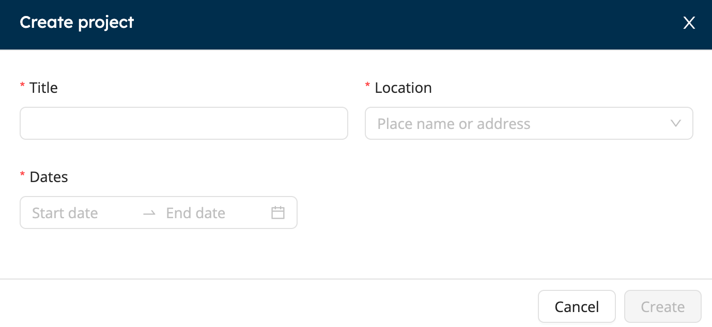
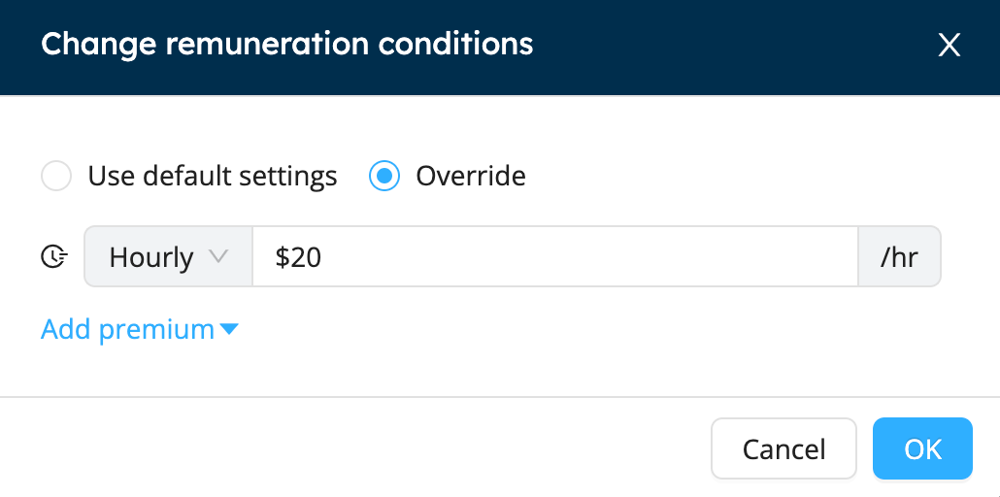

# Plan an Event

## Creating a New Project

Creating a project in Workstaff is a quick and easy task:
1. In the main menu, go to the **Calendar** section 
2. Click on **New Project**
3. Fill in the information shown below to create the basis for detailing the project later

## Adding Shifts 
Once you have created your project, you can add shifts: 
1. On the project page, click on **Create Shift**
2. Select the date(s)
3. Choose the position for the shift from your list of skills
4. Select the start and end times 
5. Fill-in the number of staff needed
6. If you wish, you can add a label and select break and travel times

## Draft Mode 

When creating a new project, Workstaff makes you work in draft mode by default. This allows you to make any changes you want and apply them to the project once you are satisfied by clicking on **Review and Apply** on the project page. Only then will your staff receive a notification regarding their bookings.

You still can make changes to your project after reviewing and applying, and these new changes will automatically put your project in draft mode again.

:::note
It is critical that you **Review and Apply** the changes made to your project regularly in order to keep your information updated and to avoid overwhelming the project with massive changes when reviewing and applying. 
:::