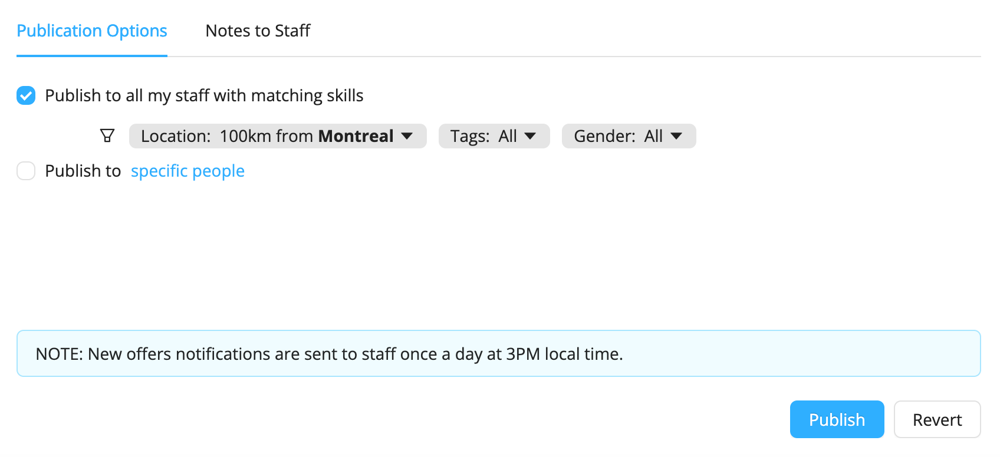

# Publish Shifts
Workstaff allows you to publish shifts, which essentially means that you can post offers that your staff can review and apply to from their mobile phones. New offer notifications are sent to staff once a day at 3PM local time. When staff have applied to the shift you have published, you can choose who to book from a list of candidates.

## Publishing a Shift 
1. On the project page, go to **Publishing**.
2. Select the position you wish to publish
3. Under **Publishing Options**, you can select whether you want to publish the shift:
- **to staff with matching skills**: you can use the filters to further narrow your search
- **to specific people**: you can select the staff you wish to send the offer to
4. Go under **Notes to staff** to add any additional information that the candidates can read upon opening the offer
5. Click on **Publish**

## Marking a Position as Filled 
Once candidates have applied for a position, and you’ve booked staff for the shift(s), you can select the position on your project page and click on **Mark as filled…** The position will then be unpublished and unbooked applicants will be notified with a courtesy message letting them know the position was filled. 
