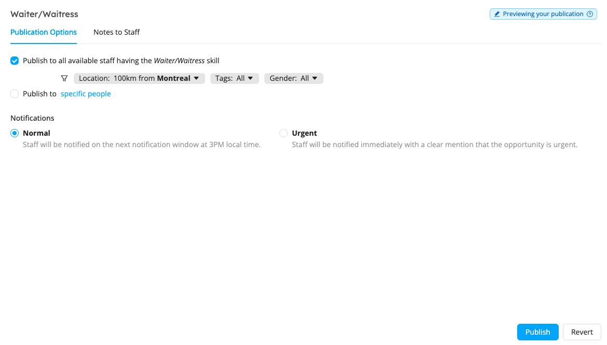
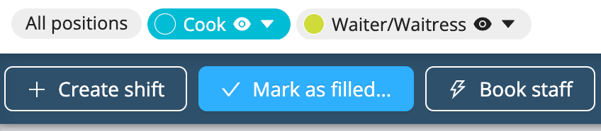

# Publish Shifts
Workstaff allows you to publish shifts, which essentially means that you can post offers that your staff can review and apply to from their mobile phones. New offer notifications are sent to staff once a day at 3PM local time. When staff have applied to the shift you have published, you can choose who to book from a list of candidates.

<iframe width="640" height="307" src="https://www.loom.com/embed/c96022293ac844c18e4233404d7bec8a" frameborder="0" webkitallowfullscreen mozallowfullscreen allowfullscreen></iframe>

## Publishing a Shift 
1. On the project page, go to **Publishing**.
2. Select the position you wish to publish
3. Under **Publishing Options**, you can select whether you want to publish the shift:
- **to staff with matching skills**: you can use the filters to further narrow your search
- **to specific people**: you can select the staff you wish to send the offer to
4. Go under **Notes to staff** to add any additional information that the candidates can read upon opening the offer
5. Choose the notification mode for this offer:
- **Normal**: Staff will be notified on the next notification window at  3PM local time
- **Urgent**: Staff will be notified immediately with a clear mention that the opportunity is urgent
6. Click on **Publish**.

If you wish to unpublish an offer at any time, go to the **Publishing** tab, select the job and click **Unpublish**.

You can also choose to re-publish an offer after removing it, while keeping track of who has already viewed and applied to that offer by clicking **Re-publish**.

:::info
If you create new staff profiles that are eligible for jobs posted before they are added to the platform, these people will be able to view these offers when they first log into the mobile app.
:::

## Marking a Position as Filled 
Once candidates have applied for a position, and you’ve booked staff for the shift(s), you can select the position on your project page and click on **Mark as filled…** The position will then be unpublished and unbooked applicants will be notified with a courtesy message letting them know the position was filled. 

## Learn More
Visit the [**Finding Work**](https://help.workstaff.app/docs/workers/shifts/offers/) page in our Help Center **for workers** to learn more and share this information with your staff. 
