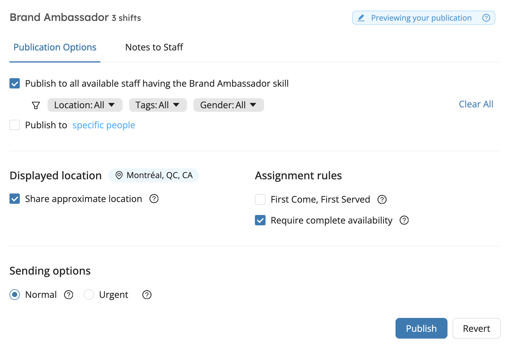

# Publish Shifts
Workstaff allows you to publish shifts, which essentially means that you can post offers that your staff can review and apply to from their mobile phones. New offer notifications are sent to staff once a day at 3PM local time. When staff have applied to the shift you have published, you can choose who to book from a list of candidates.

<iframe width="640" height="307" src="https://www.loom.com/embed/c96022293ac844c18e4233404d7bec8a" frameborder="0" webkitallowfullscreen mozallowfullscreen allowfullscreen></iframe>

## Publishing a Shift 
From the project page, navigate to the **Publishing** section and choose the position you’d like to publish. Then:

1. Under **Publishing Options**, you can select whether you want to publish the shift:
   - **To staff available with matching skills**: Use the filters to further narrow your search.
   - **To specific people**: Manually select the staff members you'd like to send the offer to.
2. Enable or Disable **Share approximate location**: When enabled, applicants will **see only the city or region**, rather than the exact work location.
3. Set the **Assignment rules**:
   - **First Come, First Served**: Applicants will be booked automatically in the order they apply.
   - **Require complete availability**: Only candidates who are available for all shifts associated with the role will be accepted.
4. Choose the **Sending Option**:
   - **Normal**: Staff will be notified during the next notification window (3 PM local time).
   - **Urgent**: Staff will be notified immediately, with a clear "urgent" label.
5. Add **Notes to Staff**: Include any additional information you want applicants to read when opening the offer. 

Click **Publish** to send your offer based on the selected options.

If you wish to unpublish an offer at any time, go to the **Publishing** tab, select the job and click **Unpublish**.

You can also choose to re-publish an offer after removing it, while keeping track of who has already viewed and applied to that offer by clicking **Re-publish**.

:::info
If you create new staff profiles that are eligible for jobs posted before they are added to the platform, these people will be able to view these offers when they first log into the mobile app.
:::

## Marking a Position as Filled 
Once candidates have applied for a position, and you’ve booked staff for the shift(s), you can select the position on your project page and click on **Mark as filled…** The position will then be unpublished and unbooked applicants will be notified with a courtesy message letting them know the position was filled. 

## Learn More
Visit the [**Finding Work**](../../workers/shifts/offers.md) page in our Help Center **for workers** to learn more and share this information with your staff. 
