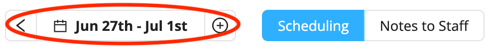
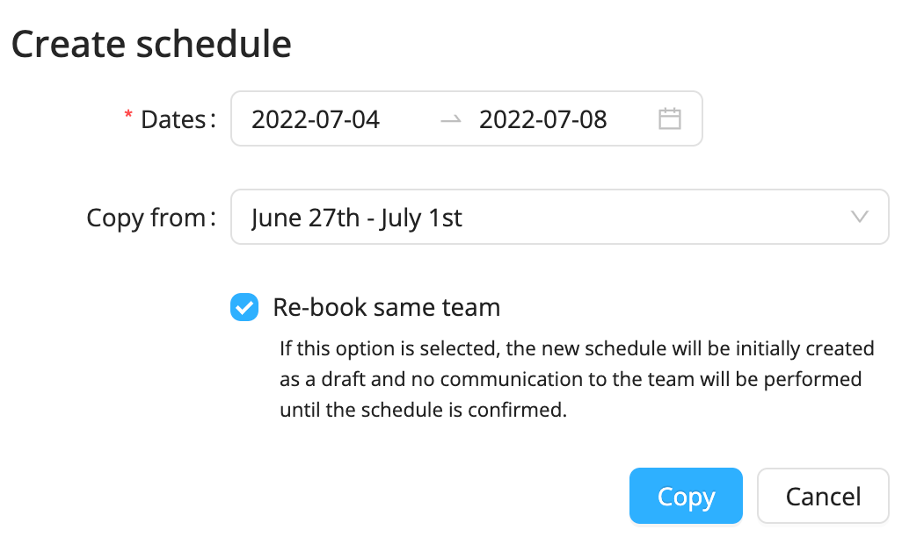
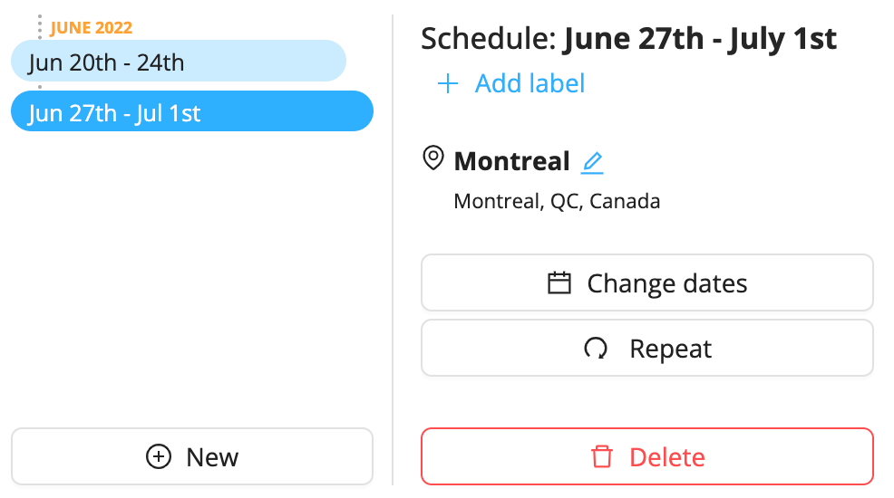

# Long-Running Events

Whether you want to create events that span a long period of time or create schedules that repeat from week to week, Workstaff allows you to divide your project into schedules in the ways listed below.
## Creating a new schedule 
1. On the project page, click on the schedule tab

2. Click on **New**
3. Select the dates and whether you wish to copy the schedule from an existing one in the project
4. You can then create shifts in this new schedule 

## Repeating a schedule 
If your schedule always follows the same structure, you have the possibility to repeat a schedule you have already created in the project as many times as you want. 
1. On the project page, click on the schedule tab
2. Click on **Repeat**
3. Select the dates
4. Select the dates you wish to **Copy from**
5. Choose whether you wish to **Re-book the same team** for this new schedule 

## Editing a schedule
1. Click on schedule tab and select the schedule you wish to edit 
2. You can **Add a label**, change the location and change the dates
3. Once you have selected a schedule, you can then modify your shifts and bookings

## Deleting a schedule
To delete a schedule, select it in the schedule tab and click on **Delete**.  