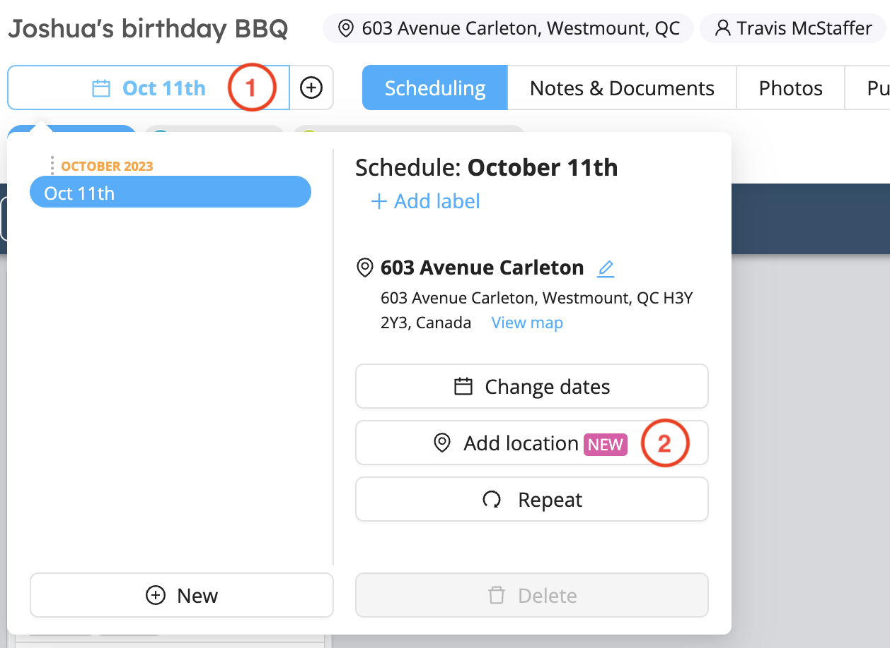
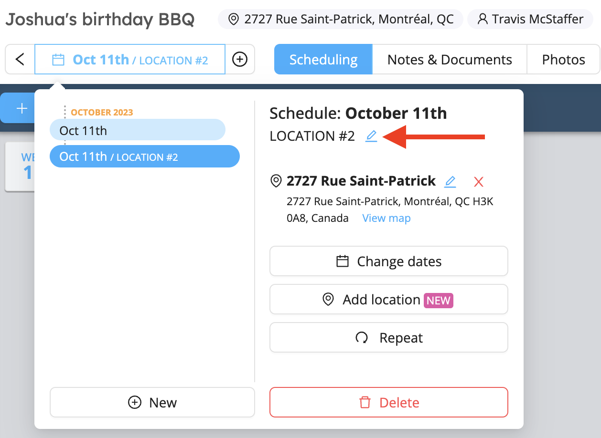

# Long-Running Events

Whether you want to create events that span a long period of time or create schedules that repeat from week to week, Workstaff allows you to divide your project into schedules in the ways listed below.

<iframe width="640" height="308" src="https://www.loom.com/embed/766b36a9fcee4754b9cb989fc87edd83" frameborder="0" webkitallowfullscreen mozallowfullscreen allowfullscreen></iframe>

## Creating a New Schedule 
1. On the project page, click on the schedule tab

2. Click on **New**
3. Select the dates and whether you wish to copy the schedule from an existing one in the project
4. Once the new schedule is creating, you can edit its location if it is different from the initial project location
5. You can then create shifts in this new schedule.

## Repeating a Schedule 
If your schedule always follows the same structure, you have the possibility to repeat a schedule you have already created in the project as many times as you want. 
1. On the project page, click on the schedule tab
2. Click on **Repeat**
3. Select the dates
4. Select the dates you wish to **Copy from**
5. Choose whether you wish to **Re-book the same team** for this new schedule 

## Editing a Schedule
1. Click on schedule tab and select the schedule you wish to edit 
2. You can **Add a label**, change the location and change the dates
3. Once you have selected a schedule, you can then modify your shifts and bookings

## Deleting a Schedule
To delete a schedule, select it in the schedule tab and click on **Delete**.  

## Adding a location
If your projects contain multiple locations, Workstaff allows you to create schedules for different addresses on the same day within one single project. 
Here are the steps to follow: 
1. On the project page, click on the schedule tab
2. Click on **Add location**

3. Enter the new address
4. Select whether you wish to **copy the current schedule to this location** in order to copy the same shift(s) to the new location
5. Once the new location has been added, you can edit its label, and it will also be displayed in the calendar after the project title.

