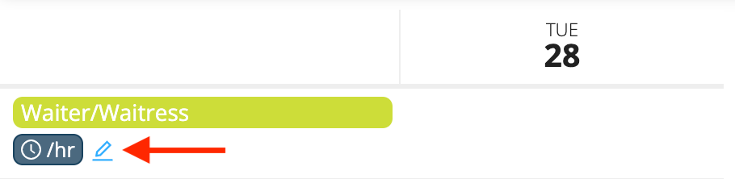

# Premiums and Compensation

Workstaff allows you to create your own premiums that you can later add to the compensation conditions in your projects if required.

You can also customize your staff's compensation conditions and to see at a glance all that is applicable to each shift.

<iframe width="640" height="307" src="https://www.loom.com/embed/97d66f48255149d599ba3d3a0ad6e409" frameborder="0" webkitallowfullscreen mozallowfullscreen allowfullscreen></iframe>

## Change Compensation Conditions For a Position
When creating an event, you can change the compensation conditions for a specific position. If unchanged, the compensation will be the same as in the staff profiles.
1. On the project page, go to the Compensation tab
2. Click on the icon indicated below to change de compensation conditions for the position
   
3. Select the type of compensation and write down the new amount. 
4. You can add premiums previously created in your **Settings**
   

Once changed, the compensation will be applicable for all shifts with this position. You can still change the compensation conditions for specific shifts. 

## Change Compensation Conditions For a Specific Shift
Workstaff also allows you to customize the compensation conditions for specific shifts.

1. Select the shift you wish to edit
2. Choose the compensation type and the amount
3. Add premiums if required for the shift
