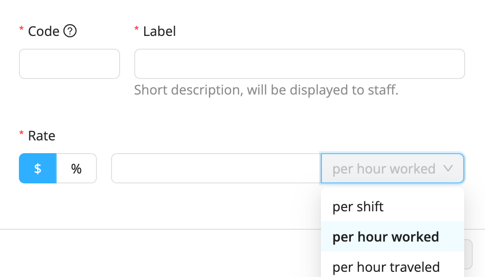

# Premiums and Remuneration

Workstaff allows you to create your own premiums that you can later add to the remuneration conditions in your projects if required.

You can also customize your staff's remuneration conditions and to see at a glance all that is applicable to each shift.

## Creating your own premiums 
Creating your own premiums is a quick and easy task. Once created, your premiums will be available when you change the remuneration conditions in your projects.
1. Go to the **Settings** section in the main menu
2. Go to the **Premiums** section
3. Click on **Add**
4. Fill in the fields and choose whether the rate is monetary or a percentage of the base wage

## Change remuneration conditions for a position
When creating an event, you can change the remuneration conditions for a specific position. If unchanged, the remuneration will be the same as the one in the staff profiles.
1. On the project page, go to the Remuneration tab
2. Click on the icon indicated below to change de remuneration conditions for the position   

3. Select the type of remuneration and write down the new amount. 
4. You can add premiums previously created in your **Settings**

Once changed, the remuneration will be applicable for all shifts with this position. You can still change the remuneration conditions for specific shifts. 

## Change remuneration conditions for a specific shift
Workstaff also allows you to customize the remuneration conditions for specific shifts.

1. Select the shift you wish to edit
2. Choose the remuneration type and the amount
3. Add premiums if required for the shift