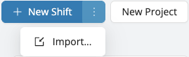

# Projects and Shifts Import Tool

Need to set up several projects at once, each with their own schedules and shifts? Our new bulk import tool makes it fast and easy.
Whether you’re onboarding a new client, preparing for a busy season, or simply want to save time, you can now import everything in just a few clicks — directly from an Excel or CSV file.

This powerful feature lets you:
- Create multiple projects in one import.
- Add schedules and shifts to each project.
- Avoid repetitive manual entry.

Download a [sample file](https://employer.workstaff.app/en/assets/import-templates/shift-import.csv) to get started.

## Pre-requisites
- If the projects you’re importing need to be linked to a client, make sure to [**add the client**](../clients/manage-client-list.md#adding-a-new-client) in Workstaff first.
- Ensure that any skills used in the imported projects already exist in your Workstaff account.

:::info
To add shifts to an existing project, please specify the project code and/or project title.
If you’d like the new shifts to be added to an existing schedule, make sure to also include the schedule label.
:::

## Importing Rules

| **Field**                 | **Mandatory?** | **Notes**                                                                                                                                                                                                           |
|---------------------------| --- |---------------------------------------------------------------------------------------------------------------------------------------------------------------------------------------------------------------------|
| Client Code               | No | If provided, finds the matching client in combination with client name (if also provided).                                                                                                                          |
| Client Name               | No | If provided, finds the matching client in combination with client code (if also provided).                                                                                                                          |
| Project Code              | No | Combined identifier for the project (with title). Use the same identifier to have multiple shifts be created under the same project.                                                                                |
| Project Title             | No | Combined identifier for the project (with code). Title for the project.                                                                                                                                             |
| Project Location          | No | Full address of the location, which will be resolved using Google Maps. If not provided, uses either the resolved Client's default project location, or the account's default location.                             |
| Schedule Label            | No | Arbitrary string to identify the schedule. If many rows provide the same schedule label, shifts will be created in the same Workstaff schedule. Maximum 40 characters.                                              |
| Schedule Location         | No | Full address of the location, which will be resolved using Google Maps. If not provided, will use the project location.                                                                                             |
| Schedule Notes - Internal | No | Internal notes for the schedule.                                                                                                                                                                                    |
| Schedule Notes - Staff    | No | Notes that will be visible to staff booked on this schedule. Can contain newline characters ("\\n"). Web links / URLs will be converted to clickable links.                                                         |
| Schedule Position Notes   | No | Notes that will be visible to staff booked on this schedule and at the position specified in the "Shift Skill" cell. Can contain newline characters ("\\n"). Web links / URLs will be converted to clickable links. |
| Shift Date                | Yes | ISO-8601 format (ex: "2025-05-23")                                                                                                                                                                                  |
| Shift Start Time          | Yes | The time at which the shift is scheduled to start. 24 hours format (ex: "16:45")                                                                                                                                    |
| Shift End Time            | No | The time at which the shift is scheduled to end. If not provided, a shift duration must be provided (see other field). 24 hours format (ex: "16:45")                                                                |
| Shift Duration Minutes    | No | The duration (in minutes) expected for this shift. Used only if "Shift End Time" is not provided or empty. Ex: "360" for 6 hours                                                                                    |
| Shift Pause Duration      | No | The duration (in minutes) for unpaid pause / break time. Ex: "30" for 30 minutes.                                                                                                                                   |
| Shift Skill               | Yes | The name of the Skill configured in the Workstaff account.                                                                                                                                                          |
| Shift Travel Duration     | No | The duration (in minutes) for travel time. Ex: "120" for 2 hours.                                                                                                                                                   |
| Shift Positions           | No | Number of positions to fill for this shift. Defaults to 1 if not provided.                                                                                                                                          |
| Shift Label               | No | An arbitrary label for this shift. Maximum 40 characters.                                                                                                                                                           |
| Shift Notes - Internal    | No | Internal notes for the shift.                                                                                                                                                                                       |
| Shift Notes - Staff       | No | Notes that will be visible to staff booked on this shift. Can contain newline characters ("\\n"). Web links / URLs will be converted to clickable links.                                                            |

## Uploading your file

When filling out the import file, make sure to include key information such as the project name and location on each row of the file. If this information is missing or inconsistent, the system will assume they are separate projects and create multiple ones instead of grouping them under the same project.

Once your file is ready, you can upload it from the Calendar tab by clicking the three dots next to the “New shift” button, then selecting “Import”.
If you don’t see this option in your account, please [contact us](mailto:support@workstaff.app) and we’ll activate it for you.

During the upload process, the system will automatically detect and display any errors before the import is finalized. This allows you to make corrections and ensure a clean import.

:::warning
We recommend testing your file with one or two projects first before proceeding with a larger import.
:::

You’ll be able to track the progress of the import directly in the interface. Once it reaches 100%, your projects and shifts will be fully created — and you’ll be all set to start booking staff!