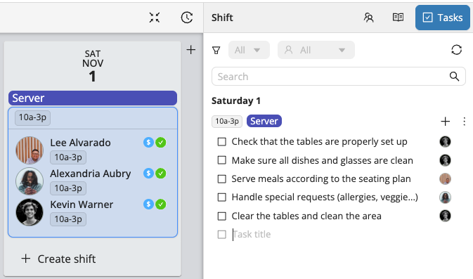
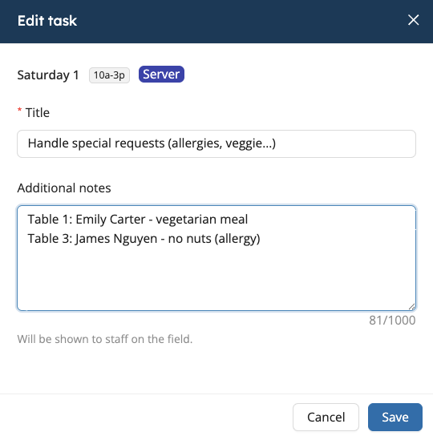
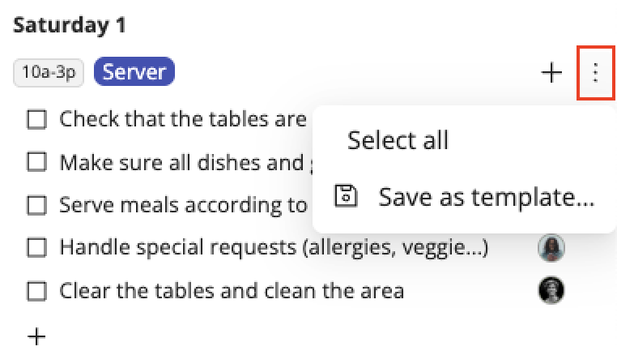

# Shift Tasks

Shift Tasks help you **organize, track, and communicate** what needs to be done before, during, or after a shift - making it easier to keep your team aligned and your operations running smoothly.
Whether it’s preparing equipment, checking in at a location, or closing up after an event, Shift Tasks give you full visibility into what’s completed and what’s still in progress.  

## Creating Tasks

1. Select the **Shift** where you’d like to add tasks. 
2. Go to the **Tasks** tab in the inspector on the right side of your screen.  
3. Click **+** to add a task.  
4. Enter a **title** and press **Enter**.

You can also add **detailed instructions** by clicking the sheet icon that appears on the right of when you hover over the task.

## Saving Your Task List as a Template

To reuse your task list across shifts or projects, click the **three dots** in the top-right corner of your list and select **Save as template**.  

Then, to apply your newly created template to another shift, click the **+** at the top and select **Add from template**.

## Assigning Tasks

To assign a task to a **specific staff member**, click the empty avatar on the right side of the task.

:::info
If a task is assigned **4 hours or less before the start of a shift**, the staff member will receive a **push notification**.  
They’ll find the task in their **Workstaff app**, under the shift details, and can **mark it as completed** directly once it’s done.
:::

### Team Lead Permissions

When a **Team Lead** is assigned to a shift, they have additional permissions to help manage tasks more efficiently:
- They can **mark a task as completed**, including on behalf of another staff member.  
- They can **assign or reassign** a task to another team member.  
- They **receive a notification** each time someone on their team completes a task. 
- They can also remove the **completed** status from a task if needed.  

These permissions allow the Team Lead to monitor progress in real time and ensure all tasks are completed as expected.