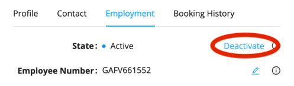
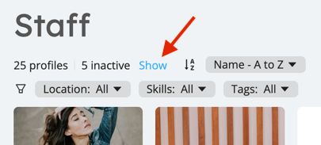
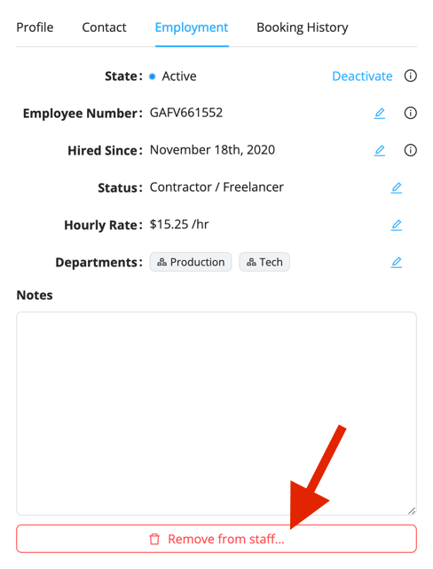

# Removing Staff From Your Database

For any reason, if you need to remove a staff from your database, you have two options. These options are detailed below.

## Make a Profile Inactive

Making a profile inactive will not remove the profile from your database but will essentially hide it. 

Inactive profiles:

- Do not show up as candidates or suggestions for bookings
- Do not receive any notifications for new work offers
- Are hidden in the main **Staff** listing

This is handy when your workers are temporarily laid off, for seasonal workers, or for any situation where keeping 
a profile visible is just inconvenient. 

To make a profile inactive:

1. Open the staff profile you wish to remove in the **Staff** section.
2. Go to the **Employment** tab.
3. Click the **Deactivate** link.

### Reactivate an Inactive Profile

You can reactivate an inactive profile at any time. To find an inactive profile, either use the Search Everywhere tool,
or select the option to **Show** inactive profiles in the main **Staff** section: 

Once you found the profile to reactivate:

1. Open the staff profile you wish to reactivate.
2. Go to the **Employment** tab.
3. Click the **Reactivate** link.

## Completely Remove a Profile

In case you want to completely remove a profile from your database instead of making it inactive, proceed as such:

1. Open the staff profile you wish to remove in the **Staff** section. 
2. Go to the **Employment** tab. 
3. Scroll all the way to the bottom and click **Remove from staff**.

Although the profile itself will be removed from your database, the staff's activity history (bookings, messages, 
invoices, etc.) will be kept and nothing else than the profile will be removed.
