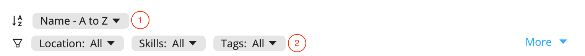
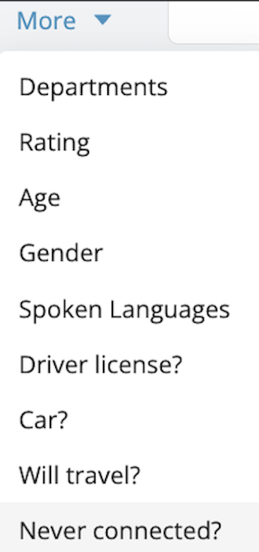
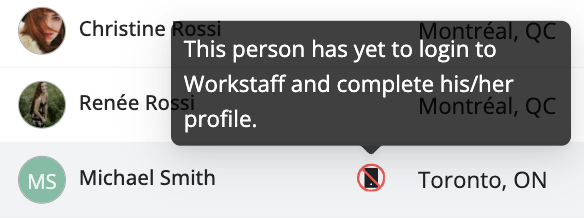

# Searching & Filtering Your Staff
The information you provided each profile facilitates searching and filtering your staff.

When searching for workers in the **Staff** section and when booking staff, you can:
1. Select the order in which you wish to see the profiles appear in your list
2. Use a variety of filters based on the information specific to each profile to specify your search. You can access additional filters by clicking on **More**.

## Identifying Staff Who Haven’t Logged In Yet

After adding new staff members to your account, you may want to verify which profiles have not yet logged into the app. This is especially useful to ensure everyone has activated their account and is ready to receive bookings.
You can easily filter your staff list to display only team members who have never connected:
- Go to your **Staff List**
- Open the **+ More** options.
- Select **Never Connected?**

This will display only the profiles that have not logged into the app yet.

:::note
If you see a **phone icon with a slash** next to a staff member’s name, it means they have never logged into the app.
:::