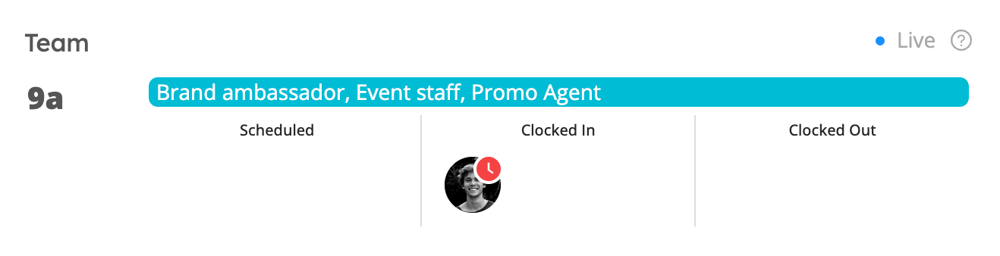

# Clock In / Clock Out

Workstaff allows your employees to clock in and out of a shift through different options you can choose from.
As an employer, this feature allows you to track your staff’s time in real time. 

## Clock in / Clock out options  
You can customize your **Time Tracking** preferences in the [settings](../customize/account.md).   
Your staff will then be able to clock in and out of shifts from their mobile phones.  
Once your employees have clocked in and out of a shift, they will be instructed to **[submit a timesheet](submissions.md)** that you can then review and approve. 

### Clock in/Clock out via QR code
If you have chosen the clock in/clock out via QR Code option, you can download the QR code to use to clock in and out of a specific event.

1. Go to your project page
2. Go to the **Time Tracking** tab
Click on **QR Code** to download the QR code for this project in PDF format.

## Live time tracking 
Keep track of your staff's time by going to the **Today** section in the main menu, and clicking on the event under the **Dashboard**. Staff presence will automatically update as staff clock in and out using the mobile app. 

