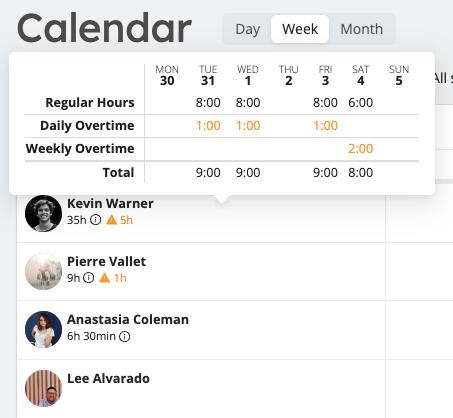
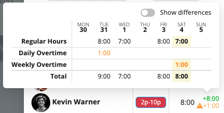

# Overtime

Workstaff can calculate [and compensate](../payroll/overtime.md) overtime automatically, both daily and weekly.

## Warnings

When [overtime rules](../customize/overtime.md) are configured in your account, Workstaff will display warnings at relevant locations, such as the weekly calendar view or when booking staff. 
These warnings are designed to highlight situations where unwanted overtime would be introduced by booking a certain staff.

### In weekly calendar

In the weekly calendar view, a small warning will be displayed for any staff who has overtime hours scheduled for the current week:

### When booking staff

When booking staff using the **Book staff** button on project pages, Workstaff provides warnings if the bookings exceed the overtime limits. 
Hover over the warning to view details about the overtime hours. 
Additionally, you can click on **Show differences** to see the changes made by the current booking(s).

## How are overtime hours calculated?

Overtime hours are always calculated based on full work weeks. These work weeks always match the **First Day of Week** configured in your account general settings.

To calculate overtime, Workstaff takes all shifts worked by a staff during a week and applies overtime rules configured on your account. 
**Daily overtime** rules are applied first, followed by **weekly overtime** rules. 
Weekly rules are always applied based on the non-overtime hours calculated daily.

If your workplace uses [**Overtime Averaging**](../customize/overtime.md#averaging-period), overtime is calculated based on the **average number of hours worked per week** over the selected period - either **2 or 4 weeks**.  
This ensures that overtime is only generated when the average weekly total exceeds the defined threshold over the entire averaging cycle.

This process is quite complicated and is easier to understand with examples:

### Examples with daily rules

Workstaff applies daily rules independently for each day worked.

**Single daily rule with limit at 8 hours per day**

|                    | MON  | TUE | WED | THU | FRI  | SAT | SUN |
|--------------------|------|-----|-----|-----|------|-----|-----|
| Hours Worked       | 7h   | 8h  | 9h  | 9h  | 7.5h |     |     |
| Regular Hours      | 7h   | 8h  | 8h  | 8h  | 7.5h |     |     |
| Daily Overtime @8h |      |     | 1h  | 1h  |      |     |     |     

**Two daily rules with limit at 8 hours and 12 hours per day**

|                     | MON | TUE | WED | THU | FRI | SAT | SUN |
|---------------------|-----|-----|-----|-----|-----|-----|-----|
| Hours Worked        | 7   | 8   | 13  | 7.5 | 12  |     |     |
| Regular Hours       | 7   | 8   | 8   | 7.5 | 8   |     |     |
| Daily Overtime @8h  |     |     | 4   |     | 4   |     |     |     
| Daily Overtime @12h |     |     | 1   |     |     |     |     |

### Examples with weekly rules

Workstaff applies weekly rules based on the cumulative sum of hours worked during the week.

**Single weekly rule with limit at 35 hours per week**

|                      | MON | TUE  | WED  | THU  | FRI | SAT | SUN |
|----------------------|-----|------|------|------|-----|-----|-----|
| Hours Worked         | 8.5 | 8    | 9    | 9    | 7.5 |     |     |
| 👉 Cumulative        | 8.5 | 16.5 | 25.5 | 34.5 | 42  |     |     |
| Regular Hours        | 8.5 | 8    | 9    | 9    | 0.5 |     |     |
| Weekly Overtime @35h |     |      |      |      | 7   |     |     |     

**Two weekly rules with limits at 35 hours and 40h per week**

|                      | MON | TUE  | WED  | THU  | FRI | SAT | SUN |
|----------------------|-----|------|------|------|-----|-----|-----|
| Hours Worked         | 8.5 | 8    | 9    | 9    | 7.5 | 8   |     |
| 👉 Cumulative        | 8.5 | 16.5 | 25.5 | 34.5 | 42  | 50  |     |
| Regular Hours        | 8.5 | 8    | 9    | 9    | 0.5 |     |     |
| Weekly Overtime @35h |     |      |      |      | 5   |     |     |     
| Weekly Overtime @40h |     |      |      |      | 2   | 8   |     |     

**Single weekly rule with limit at 40h per week, with two-week averaging enabled**

**Week 1:**

|                        | MON | TUE | WED | THU | FRI | SAT | SUN |
|------------------------|-----|-----|-----|-----|-----|-----|-----|
| Hours Worked           | 8   | 8   | 8   | 7   | 12  |     |     |
| 👉 Cumulative          | 8   | 16  | 24  | 31  | 43  |     |     |
| Regular Hours          | 8   | 8   | 8   | 7   | 9   |     |     |
| Weekly Overtime @40h   |     |     |     |     | 3   |     |     |    

**Week 2:**

|                        | MON | TUE | WED | THU | FRI | SAT | SUN |
|------------------------|-----|-----|-----|-----|-----|-----|-----|
| Hours Worked           | 5   | 8   | 5   | 8   | 12  |     |     |
| 👉 Cumulative          | 5   | 13  | 18  | 26  | 38  |     |     |
| Regular Hours          | 5   | 8   | 5   | 8   | 12  |     |     |
| Weekly Overtime @40h   |     |     |     |     |     |     |     |    

**Summary:**

|           | Total Hours Worked | Weekly Overtime @40h | Two-week Averaging |
|-----------|--------------------|----------------------|--------------------|
| Week 1    | 43                 | 3                    | 3                  |
| Week 2    | 38                 | 0                    | -2                 |
| **Total** | **81**             | **3**                | **1**              |

Over a two-week averaging period, the employee worked **43 hours** in the first week and **38 hours** in the second week - for a total of **81 hours**.  
Since the overtime threshold is **80 hours** for the two-week period, **only 1 hour** counts as overtime.

### Example with both daily and weekly rules

When both daily and weekly rules are present, Workstaff first applies daily rules, then applies weekly rules.

**Combined daily rule with limit at 8 hours, and weekly rule with limit at 35 hours per week**

|                      | MON | TUE | WED | THU | FRI | SAT | SUN |
|----------------------|-----|-----|-----|-----|-----|-----|-----|
| Hours Worked         | 9   | 8   | 10  | 9   | 9   | 6   |     |
| 👉 Cumulative        | 9   | 17  | 27  | 36  | 45  | 51  |     |
| Regular Hours        | 8   | 8   | 8   | 8   | 3   | 0   |     |
| 👉 Cumulative        | 8   | 16  | 24  | 32  | 35  | 35  |     |     
| Daily Overtime @8h   | 1   |     | 2   | 1   | 1   |     |     |     
| Weekly Overtime @35h |     |     |     |     | 5   | 6   |     |     

## Overtime compensation

It is the Payroll module that calculates [precise compensation for hours worked in overtime](../payroll/overtime.md). Make sure you plan includes this functionality if you wish to compensate overtime hours.