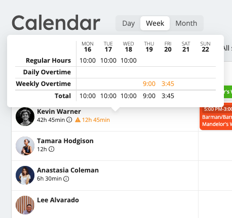
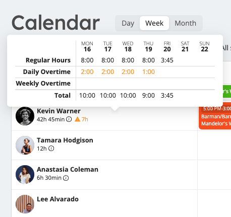

# Overtime
Based on the overtime rules you have selected in the **Account** tab of the **Settings** section, Workstaff warns you of any overtime hour worked by your staff. 

## Visual Warnings and Tracking
When employees exceed the daily and/or weekly time limits, Workstaff displays warnings on the weekly calendar. These warnings are accompanied by the total number of hours worked during the week. Let's break down the different scenarios:

- **Weekly Overtime**   
For instance, if the weekly limit is set to 30 hours, any hours worked beyond this limit are highlighted in the weekly calendar under the respective worker's name. Hovering your mouse over the warning sign provides detailed overtime information.  

- **Daily Overtime**   
Similarly, if the daily limit is 8 hours, Workstaff displays any extra hours worked on the daily calendar view when this limit is surpassed.  

- **Combined Daily and Weekly Overtime**   
When both weekly and daily overtime rules are set, weekly overtime is calculated from regular hours after daily overtime has been factored in.  

### Booking Staff with Overtime Alerts
When booking staff using the **Book staff** button on project pages, Workstaff provides warnings if the bookings exceed the overtime limits. Hover over the warning to view details about the overtime hours. Additionally, you can click on **Show differences** to see the changes made by the current booking(s).  
