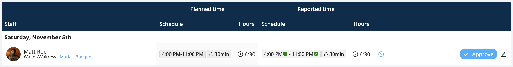
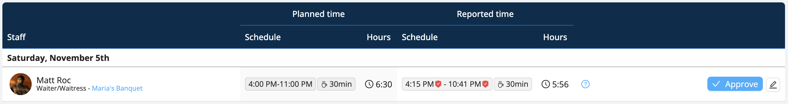

# Time Submission & Approval

Once your staff have clocked in and out of a shift, they'll be instructed to submit their timesheets from their mobile phone. Workstaff facilitates keeping track of your staff’s time submissions.

<iframe width="640" height="306" src="https://www.loom.com/embed/20ed462f9e3c4cc6a809ef318fad8507" frameborder="0" webkitallowfullscreen mozallowfullscreen allowfullscreen></iframe>

## Timesheets 
You can easily overview the timesheets submitted by your staff by going to the **Timesheets** section in the main menu.
This section allows you to filter the timesheets in the ways listed below:
- **All**: Display all upcoming, pending and approved timesheets.
- **Awaiting Submission**: display only the timesheets that your staff has not yet submitted
- **To Approve**: display all timesheets submitted by your staff

You can export excel reports from the timesheets by clicking on **Download**.

### Trust Verifications 
For each timesheet, the Timesheets section shows you the scheduled time and the submitted time.
If the information does not match, Workstaff will show you directly on the timesheet what the incorrect data is so that you can verify it, and if necessary, contact your staff.

The trust verifications are the following:
- **Passed**: if the submitted time matches the scheduled time and the time clock data is correct, the verification icon is green.

- **Failed**: if the submitted time does not match the planned time and the time clock data is incorrect, the check icon is red. Hover your cursor over the icon to view the verification details. Workstaff will tell you if the clocking in and out was done on time and at what distance from the work site.

You can edit a timesheet if the information it contains is incorrect or if the staff forgot to clock in or out.

