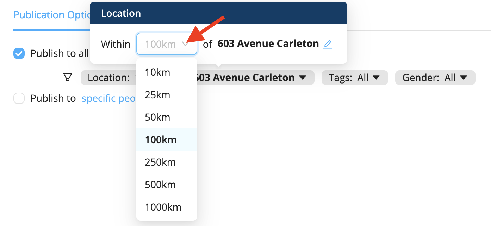

# Staff Cannot See Published Offers

## No Skills Associated with the Profile
In some cases we have observed, staff members were not able to see job offers because no skills had been added to their profile. Make sure you add skills to your staff's profiles so they can see jobs that match those skills.

## Distance Issue
Sometimes your staff can't see offers in the **Find Offers** tab of the mobile app. In most of the cases we observed, this was due to the fact that the distance between the work location and the location stored in the worker's profile was too great. By default, a job offer is displayed for employees located 100 km or less from the work location.

This issue is usually resolved when you change the job offer distance.
1. Go to the Display tab of your project
2. Click on the **Location** button

3. Choose the distance to display the offer

This issue can also be resolved by having staff change the city of residence in their profile to a city closer to your location.
  

Visit the [**I Can’t See Published Offers**](https://help.workstaff.app/docs/workers/troubleshooting/cannot-see-offers/) page in our **Help Center** for workers to learn more and share this information with your staff. 