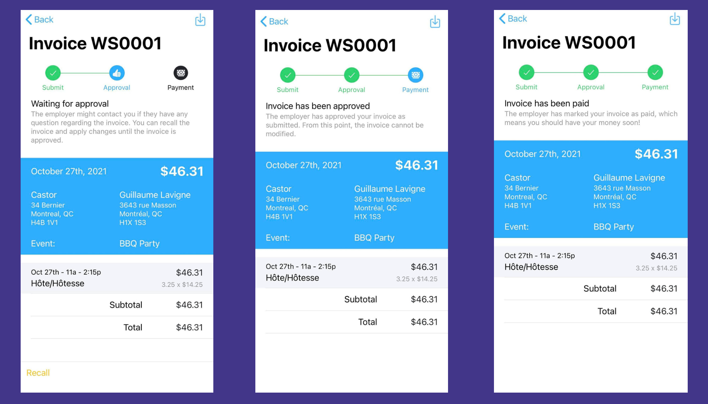

# Create Invoices for Your Hours

:::important Invoices are for Autonomous Workers / Contractors
Workstaff will only offer you to create invoices for the time you worked if your employer has declared your employment 
status as an Autonomous Worker / Contractor.
:::

Once you have submitted your hours, and these hours have been approved, Workstaff allows you to quickly and effortlessly 
create and send invoices to your employer.

## Accessing Your Invoices

All the tools required to manage your invoices are located in the **Invoicing** section. You can access that section in a few ways:

- In the **Today** tab, if any past shift can be invoiced, an option to **Send your invoice for past shift(s)** will be displayed under **Things To Do** 
- In the **Profile** tab, open to the **Invoicing** section.

## Before You Start

You'll need to provide a few invoicing-related information before you can use the **Invoicing** page. Follow the instructions shown on screen to set yourself up for invoicing.

## When Can Shifts Be Invoiced?

Only shifts meeting the following criteria can be invoiced:

- Shift must have been completed
- Shift must be remunerated (must have earnings)
- A time entry must have been [submitted and approved](./manage-your-time/report-your-time.md)
- Your employer must have declared your employment status as Autonomous Worker.

If some of your shifts do not appear in the Invoicing section but you think they should, please get in touch with your employer and make sure the above conditions are all met.

## Filling-in and Sending an Invoice

Once you complete a shift that can be invoiced, that shift, along with any other shift you've completed that can also be invoiced will be listed at the very top of the invoicing section

1. Tap on **+ Invoice** button next to the schedule to create an invoice in **Draft** mode.
2. Verify and/or edit the invoice information. You can tap any line to change it.
3. You can also **Add a line** to add any custom line not covered by Workstaff. 
4. Press **Submit for Approval** when the information is correct and you're ready to submit your invoice.

:::tip Pro Tip
If you have worked on multiple shifts within the same schedule, they will be consolidated in different lines within the same invoice. If you work multiple shifts on the same event or schedule, we highly suggest to **wait until you complete all shifts before invoicing them**.
:::

## Modify / Recall a Submitted Invoice {#recall}

If you've submitted an invoice but need to correct it, or if your employer as requested corrections after your submitted an invoice, your need to recall it:

1. Tap **Recall** at the bottom of the invoice screen.
2. The invoice gets back to **Draft** mode and you can edit it as per your needs.
3. Once your changes are completed, you can **Submit for Approval** again.

:::note
Only invoices not yet approved by your employer can be recalled. Once recalled, an invoice cannot be deleted and must instead be voided.
:::

## Invoicing Process 
Once your invoice has been submitted, you will be able to view its progress, including when the invoice is **approved** and scheduled to be **paid**.

