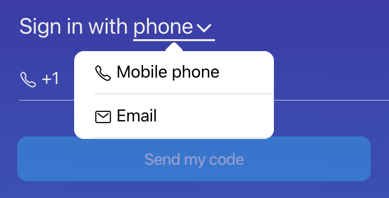

:::caution Workstaff is by invitation only.
It is not possible to register for Workstaff by yourself at this time. To log in to Workstaff, you must first have been
invited by an employer who uses the app to manage their team.
:::

# I Can't Connect to Workstaff

Sometimes you may have difficulties logging in to the mobile app. In most cases, we have observed that this is usually due to one of the following reasons:

- Your employer has not yet created an account for you.
- Your contact information may not be correct in the profile created by your employer.
- The contact information you entered during login may not match the information your employer used to create your account.

## Possible Solutions

When entering your contact information to log in, be sure to type it yourself rather than copying and pasting it.

If you are unable to log in, contact your employer to ensure that they have created a profile for you and that your contact information is correct.

## I don't have a cell phone number or my phone is not North American

Workstaff allows workers to log in to the mobile app without a password, via a 6-digit security code sent via text message to a North American phone number (beginning with `+1`). This code combined with your phone number is used to validate that you are the person your employer invited.

If you have a phone from another numbering plan than North American, or if you do not have access to a phone that can receive text messages, be sure to provide your employer with your email address. You will then be able to choose **email login** using the drop down menu on the login page:

## I'm not receiving the sign in code

When Workstaff sends you the login code by email or text message, please be patient. It can happen that there is a delay in receiving the text message or email. There is no point in sending you back a code after only a few seconds.

:::info
The login code can only be used once and is only valid for a limited time. If you send a new code to yourself, any code previously sent will no longer be valid. So make sure you always use the most recent login code.
:::
