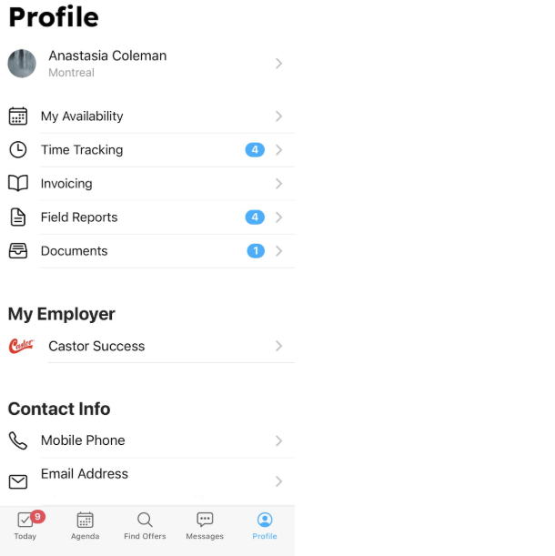

# Update Personal Information

## My Email Address or Phone Number Has Changed

To update your email address or phone number, go to the **Contact Info** section in your profile. 

Tap **Mobile Phone** to enter your new number — Workstaff will send you a verification code by text. 
For your email, tap **Email Address**, enter your new address, and confirm the change via the verification email Workstaff will send you. 

Once verified, you’ll be able to use your updated contact information to [**sign in**](../getting-started.md#sign-in).

:::note
Workstaff only supports North American phone numbers. 
If yours is not North American please take a look at the article [**I don't have a cell phone number or my phone is not North American**](./login.md#i-dont-have-a-cell-phone-number-or-my-phone-is-not-north-american).
:::

:::tip
If you’ve changed your phone number, you can still sign in using your email address, and vice versa. 
Once logged in, you can update your contact information from your profile.
:::

## My Work Location Has Changed

### I Moved to a Different Location

To update your hometown, go to the **Profile** tab in your mobile app and tap your name under **Profile**.
Then, select **Basic Information** and edit your **City of Residence**.

### I’m Working from Two Different Locations

If you’re splitting your time between two areas and are available to work in both, you can add a secondary work location.
Go to the **Profile** tab in your mobile app, tap your name under **Profile**, then select **Work locations** and enter a **Secondary Area**.

:::info
If you add a secondary work location, Workstaff will show you work opportunities from your employer(s) in both areas.
:::

