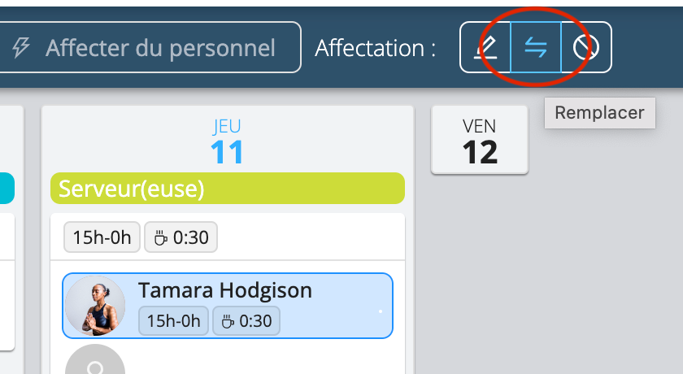
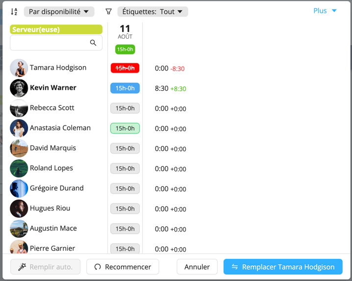
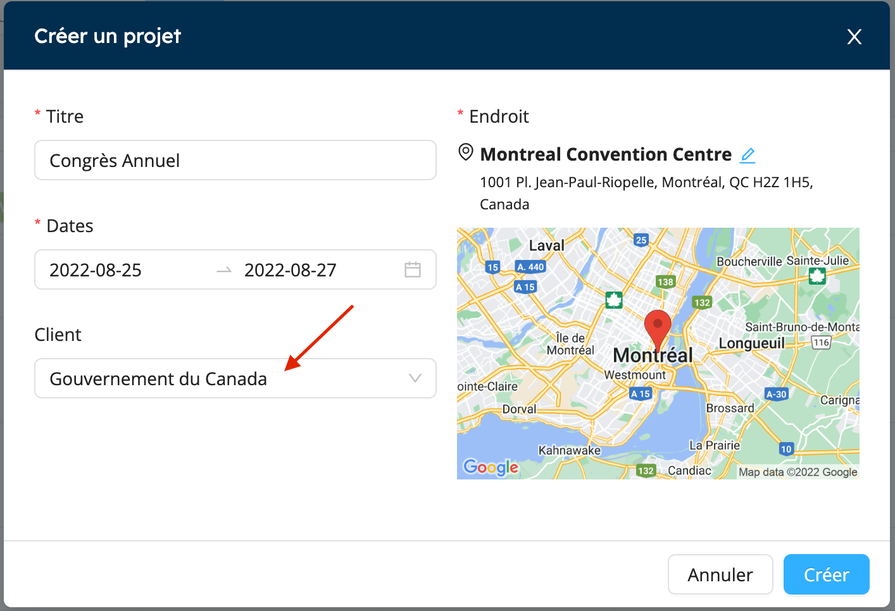
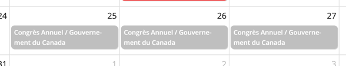
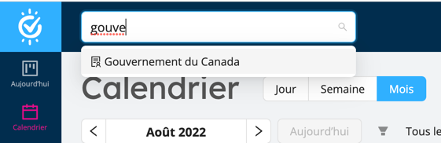
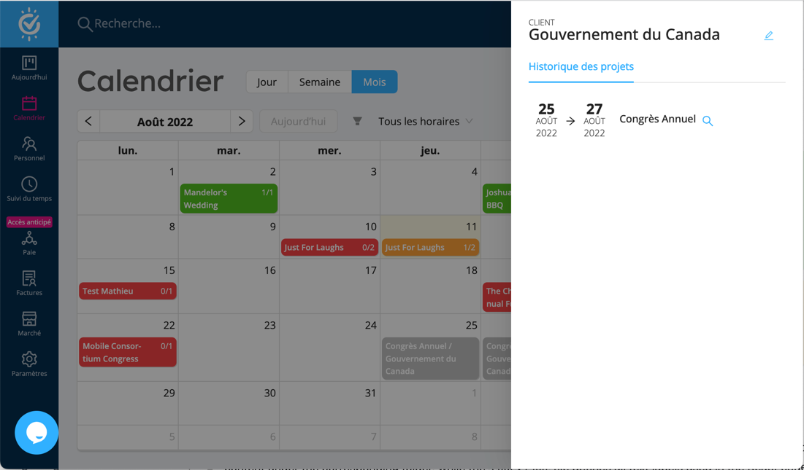
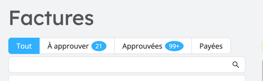
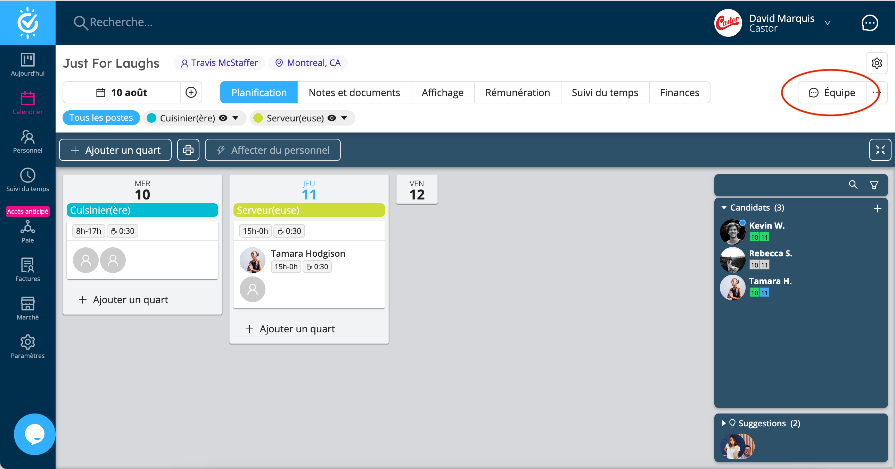

Remplacement de personnel, gestion des clients, amélioration de la facturation sur l'application mobile et quelques 
autres améliorations sont au menu de cette mise à jour.

<!--truncate-->

## Échanger / Remplacer le personnel

Auparavant, remplacer une personne affectée sur un horaire était une entreprise plutôt complexe qui nécessitait de nombreuses étapes:

1. Annuler la ou les affectations de la personne à remplacer.
2. Réserver la nouvelle personne, et éventuellement saisir à nouveau manuellement tous les détails de l'horaire de travail.

Avec **Remplacer**, cette opération fréquemment nécessaire est désormais un jeu d'enfant!

Sélectionnez une ou plusieurs réservations d'un seul employé, puis cliquez sur le bouton **Remplacer**:

Workstaff va alors lister toutes les personnes de votre équipe qui sont des candidats potentiels pour l'échange:

Sélectionnez un personnel, confirmez et c'est fait! L'ancienne affectation est annulée et une nouvelle affectation est 
créée pour la nouvelle personne, avec exactement le même horaire que la réservation précédente.

Nous sommes certains que cela fera gagner beaucoup de temps à beaucoup d'entre vous! Essayez-le et dites-nous ce que vous en pensez.

## Gestion des clients

Workstaff vous permet désormais d'associer un **Client** à tout projet. Ceci est utile si vous planifiez votre personnel sur des projets de plusieurs clients.

Un **Client** peut être spécifié lors de la création d'un projet :

Le nom du client apparaîtra dans le calendrier:

La fiche du client peut être trouvée dans la recherche globale:

Et l'historique des projets pour chaque client peut y être facilement consulté:

Il s'agit d'une première itération de nos fonctionnalités spécialement conçues pour nos utilisateurs qui planifient leur personnel avec différents
clients. D'autres nouveautés s'en viennent à ce sujet... restez à l'écoute !

## Autres nouvelles

### Centre d'aide de Workstaff

Nous avons récemment lancé le [**Centre d'aide**](https://help.workstaff.app/), 
qui est votre guichet unique pour tout apprendre sur Workstaff.

La Centre d'aide est structuré en deux zones distinctes : **Pour les gestionnaires** et **Pour les travailleurs**. 
Nous allons continuellement affiner cette documentation et y ajouter plus d'infos, alors revenez régulièrement et ajoutez la page à vos favoris pour vous y référer pour toute question sur l'utilisation de Workstaff.

### Factures: visualisez votre charge de travail

La section des factures affiche désormais le nombre de factures en état **À approuver** et **Approuvées** afin que vous puissiez mieux
visualiser votre charge de travail:

### Le Chat d'équipe: plus facilement accessible

Nous avons supprimé l'onglet **Équipe** peu utilisé sur l'écran du projet et déplacé le bouton **Chat d'équipe** pour qu'il soit plus accessible
et toujours visible sur l'écran du projet:

### Appli mobile: améliorations à la facturation

L'application mobile pour les travailleurs a été récemment mise à jour avec des améliorations dans la section facturation. Les quarts de travail qui peuvent être
facturés sont maintenant regroupés visuellement par horaire/événement pour qu'il soit plus clair que tous les quarts de travail d'un événement peuvent être facturés en même temps.

De plus, désormais seulement les quarts de travail pour lesquels une entrée de temps a été approuvée peuvent être facturés.

## Pour la suite?

Nous travaillons sur de grandes choses pour bientôt:

- **Workstaff Connect** : Donnez à vos clients accès à consulter les horaires de vos projets, consulter les rapports et permettez-leur de demander du personnel directement via un portail facile à utiliser.
- Module **Paie** : Des outils pour faciliter le traitement des paies.
